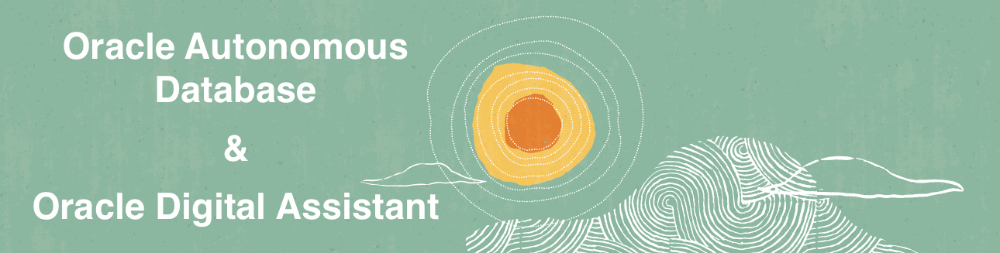

# Oracle Autonomous Database and Digital Assistant

## Conversational approach to your applications

This workshop walks you through the steps to use Autonomous Database as NoSQL repository, offer a REST API to integrate and enable you to talk to your customers by with Digital Assistant and your backend REST API.

## Who Should Read This Workshop

You want to **store information in a easy and powerful database** and provide **a 24/7 conversational experience** with the people using your services.

You want to **learn Oracle Digital Assistant** in Oracle Cloud.

You are also interested in exploring modern ways to store information like **NoSQL** technologies and build **secure and powerful RES APIs**.

## Requirements

In order to walk through this workshop you need an **active Oracle Cloud Account**. If you don't have one:

[>> Please Sign-Up a Free Tier Oracle Cloud account <<](http://bit.ly/34TzwGf)

> It takes few minutes to fully-provision your account.

After you log-in in your Oracle Cloud Account, you should see the web console, like this:

Install `Node.js`, `curl` or `PostMan`.

At this point, you are ready to start learning!

---

## Content

[Lab 1: Create Autonomous Database](lab1/README.md)

- Create your Autonomous Database
- Quick walk-through

[Lab 2: Create Application and REST API](lab2/README.md)

- Simple Object Data Access (SODA)
- Use the REST API

[Lab 3: Create Oracle Digital Assistant](lab3/README.md)

- Create a Digital Assistant instance
- Explore your Digital Assistant

[Lab 4: Implement Custom Component](lab4/README.md)

- Create a Custom Component to integrate with backend services
- Deploy the custom component

[Lab 5: Create Digital Assistant Skill](lab5/README.md)

- Build your first Skill
- Put everything together

[Appendix](appendix/README.md)

- Want to learn more?
- Troubleshooting

---

## Let's Get Started

Create Application Express (APEX): [**Go To Lab 1!**](./lab1/README.md)
