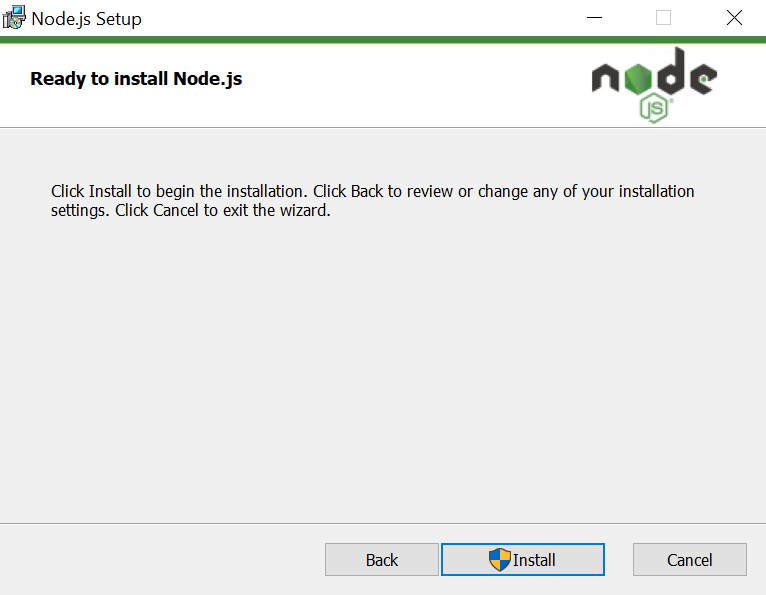
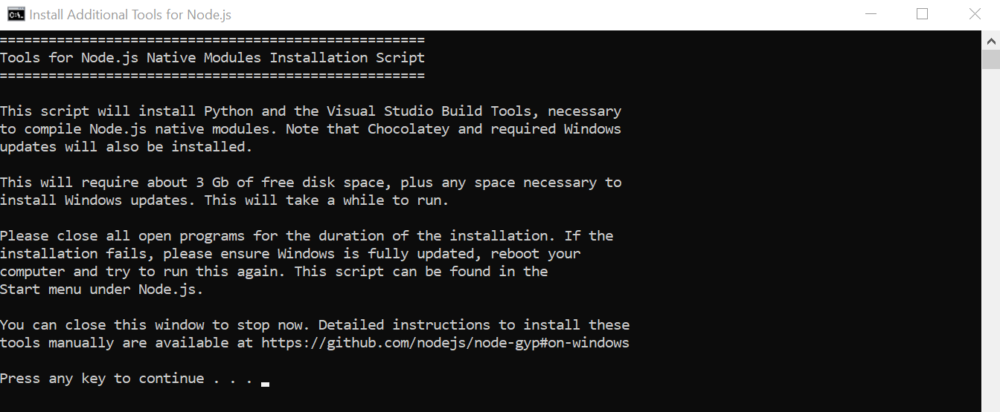
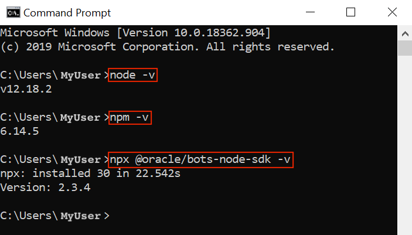
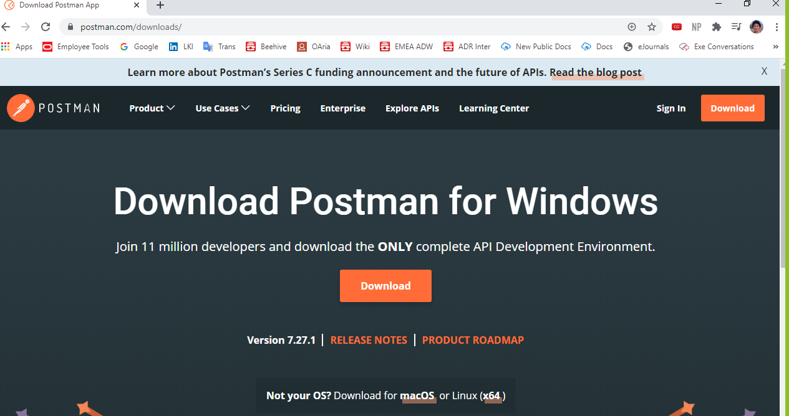
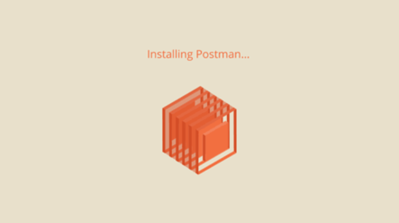
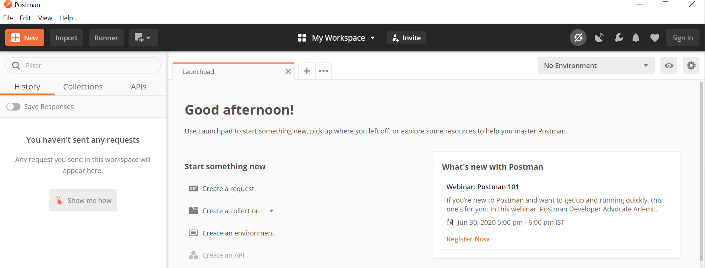

# Oracle APEX and Digital Assistant


## Conversational approach to your applications

This workshop walks you through the steps to use Autonomous Database and Application Express (APEX) to store information, offer a REST API with Oracle REST Data Services (ORDS) and enable you to interact with your customers by keeping a conversation with Digital Assistant.

## Who Should Do This Workshop

You want to **store information in a easy and powerful database** and provide **a 24/7 conversational experience** with people using your services.

You want to **learn Oracle Digital Assistant**.

You are also interested in exploring modern and quick **APEX** development and build **secure and powerful REST APIs**.

## Requirements

In order to walk through this workshop you need an **active Oracle Cloud Account**. If you don't have one:

[>> Please Sign-Up a Free Tier Oracle Cloud account <<](http://bit.ly/34TzwGf)

> It takes few minutes to fully-provision your account.

After you log-in in your Oracle Cloud Account, you should see the web console, like this:


You will also need to install:

- To develop the integration with REST API we need [Node.js](https://nodejs.org/en/download/).
- To execute REST API calls, you can install [PostMan](https://www.postman.com/downloads/) (preferred for the graphic interface users) or [curl](https://curl.haxx.se/download.html) if you want a console tool.

## Instalation of Node.js

We are going to install Node.js, if you have done this you can move ahead.

[Download Node.js LTS](https://nodejs.org/en/) from the official website. It is fine if the version is higher than the one in the screenshot.


We are going to install on Windows but it works in a similar way in Linux and MacOS.


You can go with the default setup for the installation.

Final step, click **Install**:



Installation completed


The last step sometimes take a while on Windows because the lack of libraries, plus sometimes perform a Windows Update. Another reminder to swap to Linux ;) Be patient and carry on.



Check if the installation went well. Open a Command Prompt, or Terminal in Linux and MacOS and run the following commands:

```bash
node -v
```

```bash
npm -v
```

```bash
npx @oracle/bots-node-sdk -v
```

Like this:



## Instalation of PostMan

We are going to need to install a REST API client. If you are familiar with `curl` go for it, but in this guided steps we are going to use [PostMan](https://www.postman.com/).

Go to the [Postman Download](https://www.postman.com/downloads/) website page.



Run the downloaded file to install Postman.



After a few seconds, we will have Postman up and running:



At this point, you are ready to start learning!

---

## Content

[Lab 0: Sign Up fpr your Free Oracle Trial](lab0/README.md)

- Create Your Free Trial Account
- Sign in to Your Account
  
[Lab 1: Create Autonomous Database](lab1/README.md)

- Create Your Autonomous Database
- Quick Walk-through

[Lab 2: Create APEX workshop and REST API](lab2apex/README.md)

- Create APEX Workspace
- Create a Table with Quick SQL
- REST Enabling the Database Object
- Use the REST API

[Lab 3: Create Oracle Digital Assistant](lab3/README.md)

- Create a Digital Assistant instance
- Explore Your Digital Assistant

[Lab 4: Implement Custom Component](lab4/README.md)

- Create a Custom Component to Integrate with Backend Services
- Deploy the Custom Component

[Lab 5: Create Digital Assistant Skill](lab5/README.md)

- Build your First Skill
- Import the Custom Component
- Create Intents
- Put Everything Together

[Appendix](appendix/README.md)

- Want to Learn More?
- Troubleshooting

---

## Let's Get Started

Create Autonomous Database: [**Go To Lab 1!**](./lab1/README.md)
