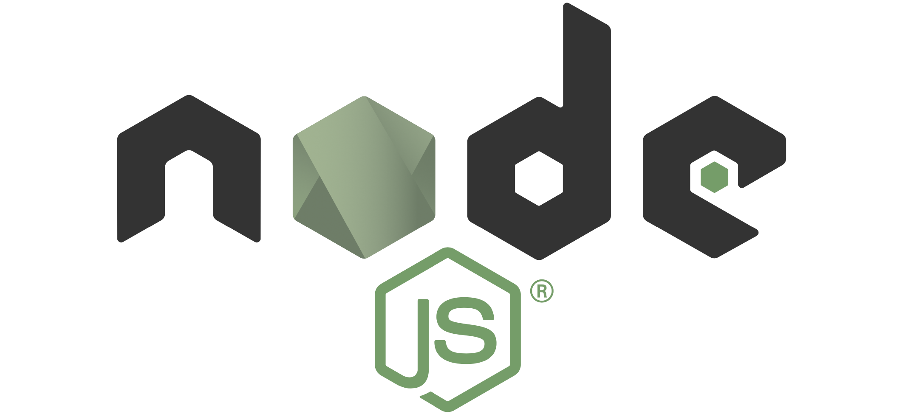

# Oracle APEX and Digital Assistant


## Conversational Approach to Your Applications

This workshop walks you through the steps to use **Autonomous Database** and **Application Express (APEX)** to store information, offer a **REST API** with **Oracle REST Data Services (ORDS)** and enable you to interact with your customers by keeping a conversation with **Digital Assistant**.

## Who Should Do This Workshop

You want to **store information in a easy and powerful database** and provide **a 24/7 conversational experience** with people using your services.

You want to **learn Oracle Digital Assistant**.

You are also interested in exploring modern and quick **APEX** development and build **secure and powerful REST APIs**.

## Content

[Get Started: Sign Up for your Oracle Cloud Free Tier](lab0/README.md)

- Create Your Free Trial Account
- Sign in to Your Account
  
[Lab 1: Create Autonomous Database](lab1/README.md)

- Create Your Autonomous Database
- Quick Walk-through

[Lab 2: Create APEX workshop and REST API](lab2/README.md)

- Create APEX Workspace
- Create a Table with Quick SQL
- REST Enabling the Database Object
- Use the REST API

[Lab 3: Create Oracle Digital Assistant](lab3/README.md)

- Create a Digital Assistant instance
- Explore Your Digital Assistant

[Lab 4: Implement Custom Component](lab4/README.md)

- Create a Custom Component to Integrate with Backend Services
- Deploy the Custom Component

[Lab 5: Create Digital Assistant Skill](lab5/README.md)

- Build your First Skill
- Import the Custom Component
- Create Intents
- Put Everything Together

[Appendix](appendix/README.md)

- Want to Learn More?
- Troubleshooting

## Requirements

In order to walk through this workshop you need to develop the integration with **REST API**. You need [Node.js](https://nodejs.org/en/) for that.

Node.js is an asynchronous event-driven JavaScript runtime. **Node.js** is designed to build scalable network applications.

We are going to **install** Node.js, if you have done this you can skip this step.



[Download Node.js LTS](https://nodejs.org/en/download/) from the official website. It is fine if the version is higher than the one in the screenshot.


We are going to install on **Windows** but it works in a similar way in **Linux** and **MacOS**.


You can go with the default setup for the installation.

Final step, click **Install**:


Installation **completed**.


The last step sometimes take a while on Windows because the lack of libraries, plus sometimes perform a Windows Update. Another reminder to swap to Linux ;) Be patient and carry on.


Check if the installation went **well**. Open a Command Prompt, or Terminal in Linux and MacOS and run the following commands:

```bash
node -v
```

```bash
npm -v
```

```bash
npx @oracle/bots-node-sdk -v
```

Like this:


At this point, you are ready to start learning!

---

## Let's Get Started

Sign Up for your Oracle Cloud Free Tier to [**Get Started!**](./lab0/README.md)
