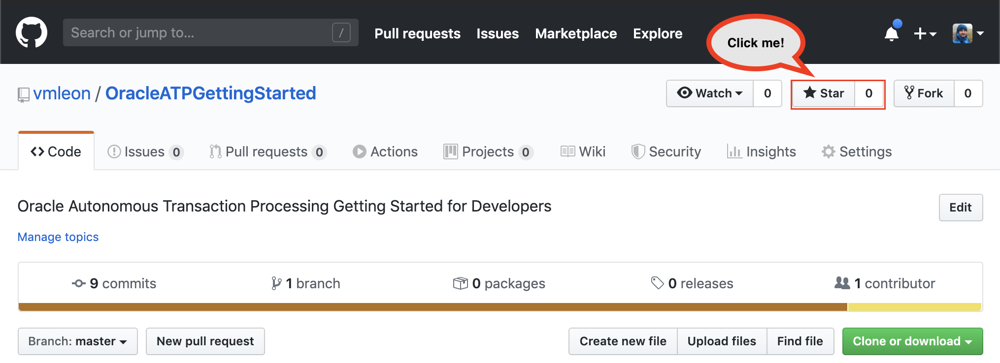

# Appendix

If you enjoy the workshop, give me a star on Github: [click here](https://github.com/vmleon/oracle-atp-da)!

Please, help us to improve. [Create an issue](https://github.com/vmleon/oracle-atp-da/issues) if you think something is not quite right.

---

## Want to learn more?

Learn about [Autonomous Database](https://github.com/vmleon/OracleATPGettingStarted) for developers and operators (Workshop)

Learn Kubernetes with [Oracle Kubernetes Engine](https://github.com/vmleon/OKE-first-steps) (Workshop)

Learn about HTTP security with [Oracle Cloud Web Application Firewall](https://github.com/vmleon/Oracle-WAF-Demo) (Workshop)

Check [Oracle Tech Exchange](https://fnimphiu.github.io/OracleTechExchange/) contains a lot of short tutorials about Oracle Digital Assistant

---

## Troubleshooting

---

[**<< Go to Lab 5**](../lab5/README.md) | [Home](../README.md)
