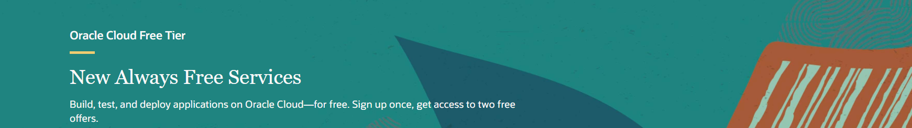
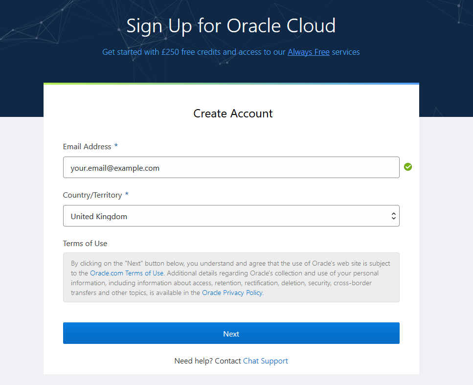
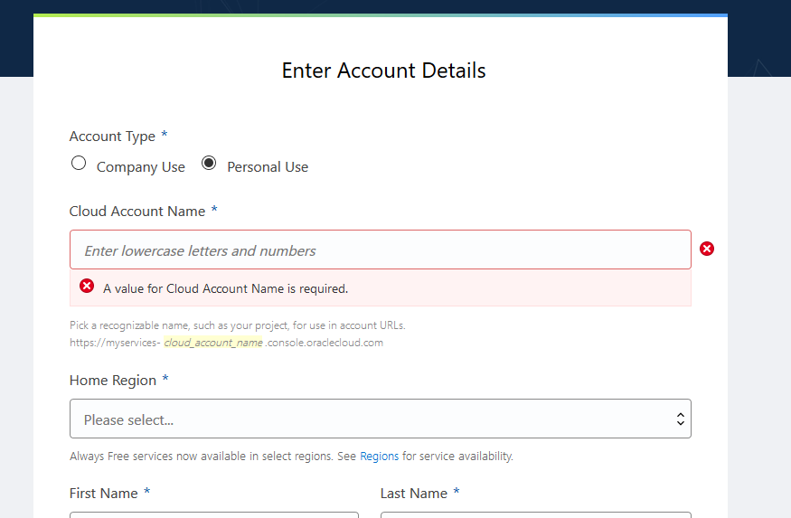
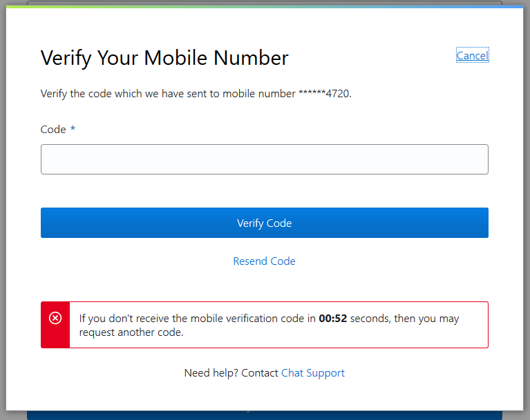
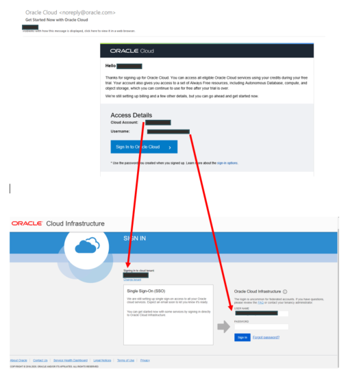
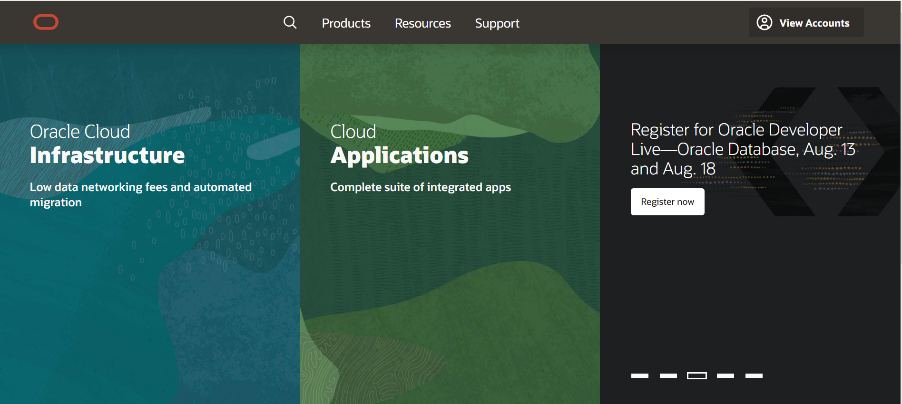
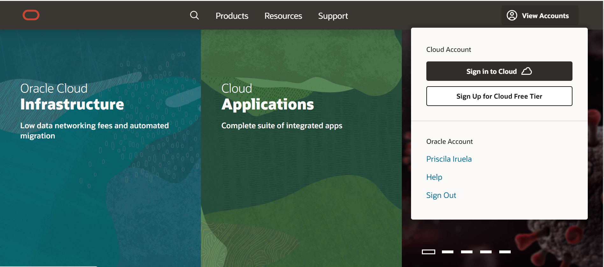
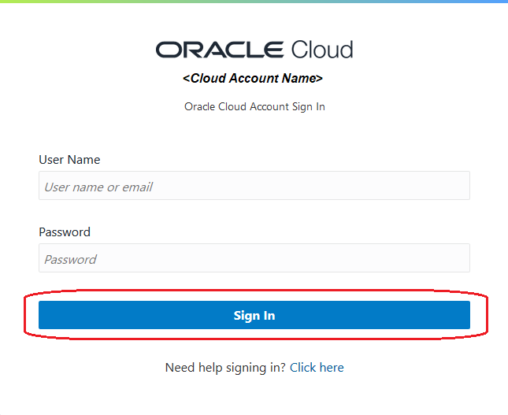

# Get Started: Sign Up for your Oracle Cloud Free Tier

During this short lab, we will create, sign in and walk through the steps of setting up an Oracle Cloud Free Tier account.

## Create Your Free Trial Account

What's included with **Oracle Cloud Free Tier**?

**Oracle Cloud Free Tier** allows you to sign up for an **Oracle Cloud** account which provides a number of **Always Free** services and a **Free Trial** with US$300 of free credit to use on all eligible Oracle Cloud Infrastructure services for up to 30 days. The Always Free services are available for an unlimited period of time. The Free Trial services may be used until your US$300 of free credits are consumed or the 30 days has expired, whichever comes first.

**Always Free** and **Free Trial** instances can be seamlessly upgraded to pay at any time. Existing Oracle Cloud customers have access to Always Free services automatically—no new sign up required.

To learn more about Oracle Cloud Always Free and Free Trial account check the following link:
[https://www.oracle.com/cloud/free/#always-free](https://www.oracle.com/cloud/free/#always-free)

As part of your sign up to this lab, you will have been provided a link to sign up to Oracle Cloud Free Tier. Please make sure you:

- Use the following URL - [>> Sign Up for Oracle Cloud <<](http://bit.ly/34TzwGf)
- Use a personal email address that you will use during all the workshop process.

On the sign up page, enter your **email address**, select your **Country/Territory** and click "**Next**".

On the "**Enter Account Details**" page you will be asked for **Account Type**, please select **Company Use** or **Personal Use** considering the purpose of this cloud account.
You will also be asked for the **Cloud Account Name** (also known as **Tenancy Name**). This will uniquely identify your cloud account and will be visible in your URL later, so please choose wisely.

Finally, you will be asked also for the "**Home Region**". This is the location of the physical datacenter. You should select a datacenter that is geographically close to you and supports the required services.

Complete all other mandatory fields on the form (indicated with a *) and select **Next**. Verify Your **Mobile Phone Number**.
You will be prompted to enter the **Code** sent to your cell phone.

## Sign in to Your Account

At the end of this process, you will receive an email titled "**Get Started Now with Oracle Cloud**". This will contain all the information you need to sign into your cloud account and include a link to the login page for your region.

To login to your cloud account, use the same email address that you used for registration and the password provided in the email. You will be prompted to set a new, more memorable password.

Otherwise go to [oracle.com](http://cloud.oracle.com).

Click **View Accounts** to bring up a menu. Click **Sign in to Cloud**.

Enter your **Cloud Account Name** and click **Next**. This is the name you chose while creating your account in the previous section. It's NOT your email address. If you've forgotten the name, see the confirmation email.

Enter your **Cloud Account credentials** and click **Sign In**. Your username is your email address. The password is what you chose when you signed up for an account.

You are now signed in to **Oracle Cloud!**

## It works

You just created an Oracle Cloud Free Tier Account.

Additionally you sign in with your account.

## Congratulations, you are ready for the next Lab!

---

[Home](../README.md) | [**Go to Lab 1 >>>>>**](../lab1/README.md)
