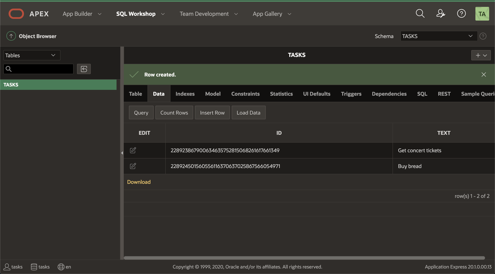
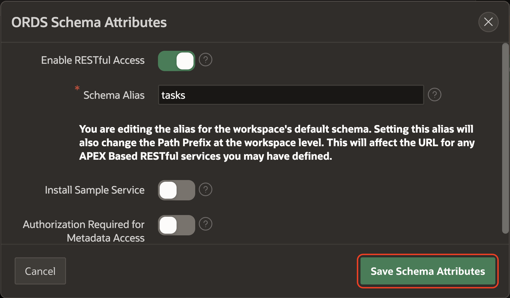
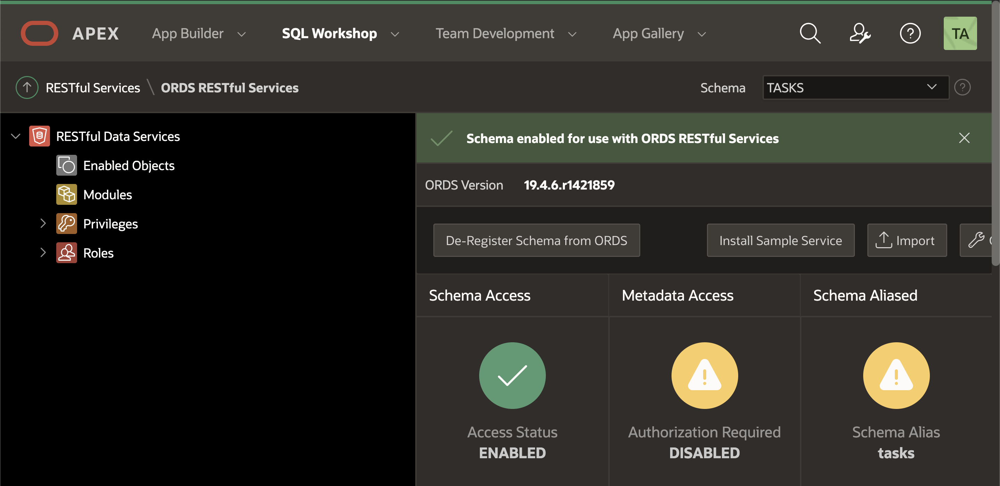
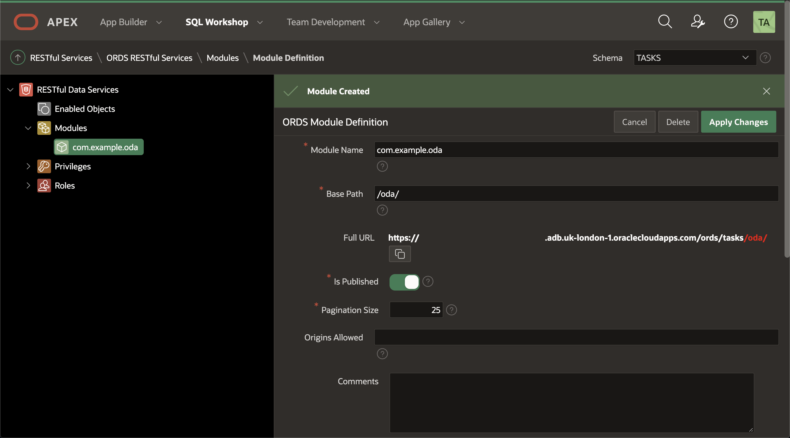
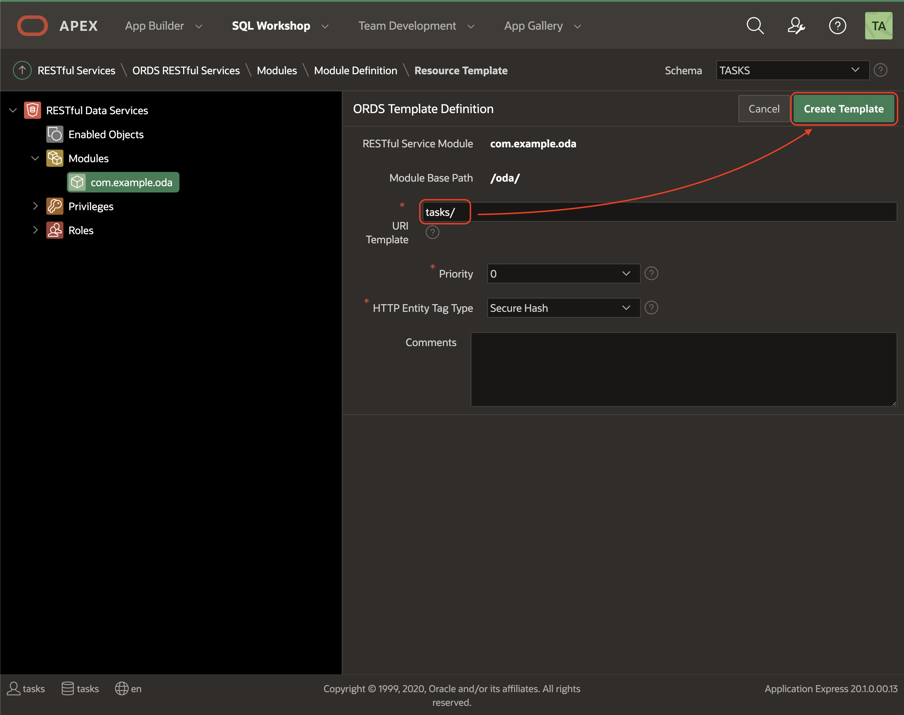
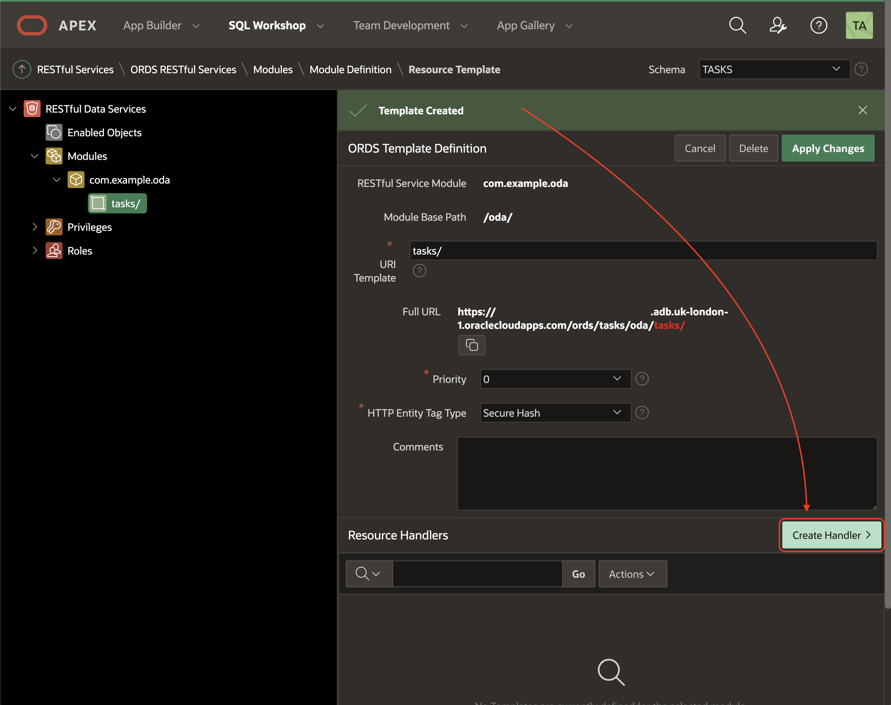
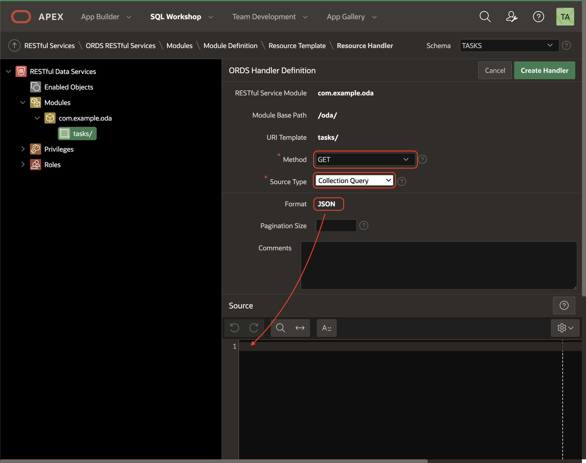
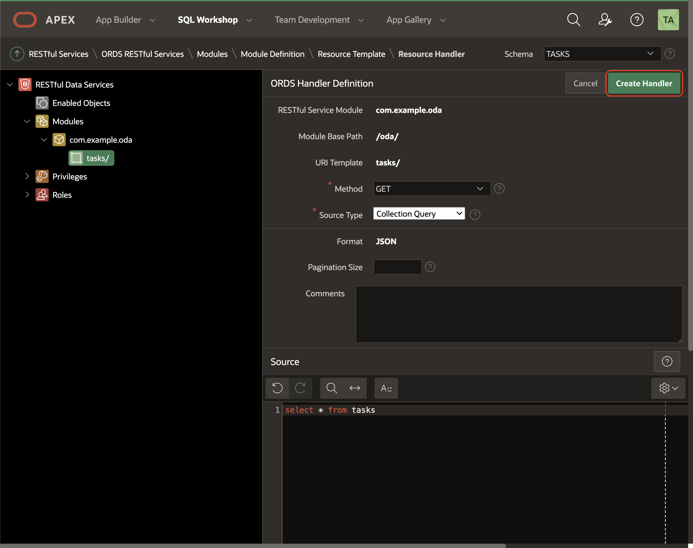

# Lab 2: Create Application and REST API


Each Autonomous Database instance includes Oracle REST Data Services (ORDS) and Simple Object Data Access (SODA) that provides HTTPS interfaces for working with the contents of your Oracle Database in REST enabled schemas.


In this lab you will create a `tasks` table, REST enabling it, and make the service available for the Custom Component. Normally, you would REST enable database objects in a remote database schema, and then utilize those REST endpoints to define Web Source modules in an application, where APEX is installed, within the local database, as outlined below.


## Create APEX Workspace

In this part of the lab we are creating an APEX workspace. From the Autonomous Database Home page go to **Tools** section and select **Oracle Application Express** area.


This will open a new browser tab for Application Express Administration.
Login as the Admin user, with the **Admin** password you specified at Autonomous Database creation time.


Create the Lab Workspace on the Welcome to "Oracle Application Express" page, select **Create Workspace**.


Use the following information to fill out the form:

- **Database User**: ATP_ODA
- **Password**: Any password that meets the Oracle Cloud requirements.
- **Workspace Name**: ATP_ODA

Select **Create Workspace**.


You will be returned to the Oracle APEX administration page, and a message will be displayed "**Workspace Created**".


Sign in as the **ATP_ODA** user by selecting the icon on the centre of the screen where you can see the name of the user, **ATP_ODA**.


Add the **name of the worspace**, **user name** and **password**: **ATP_ODA** and click **Sing in**.


Now we are ready to create your APEX application on this workspace.
You can check that you are correctly signed in with the **ATP_ODA** user in the right top corner.


## Create a Table with Quick SQL

Quick SQL reduces the time and effort required to create SQL tables, triggers, and index structures.

It is not designed to be a replacement for data modeling. Quick SQL is simply a quick way to develop a script for simple tables and views.

Once the SQL is generated it can be tweaked and expanded upon.

Quick SQL provides a quick way to generate the SQL required to create a relational data model from an indented text document.

Use Cases:

- Quickly create robust data models
- Easily generate random data
- Learn SQL create table, select, insert, index, trigger, PL/SQL package, and view syntax using provided examples

Go to Quick SQL.


Write on the left panel the following table definition:

```bash
tasks
  text
```

Click **Generate SQL**.


Click **Save SQL Script**.


Set the name of the script to `tasks` and confirm **Save Script**.


Click **Review and Run**.


Click **Run**.


Click **Run Now**.


Make sure all statements are successfully run and there are no errors.


## Insert rows on the table

We are going to mock some data to use it later with your Custom Component.

Go to the Top Menu on **SQL Workshop**, click **Object Browser**.


Select `TASKS` table on the left and click the tab `Data`, then click `Insert Row`:


Leave `Id` empty and fill the field `Text` with a task description you like. When you are happy with your new task, click `Create and Create Another` and do the same with another task:


Do the same with the second task entry:


Finally, click `Create` and check the two rows are as expected:



## REST Enabling the Database Object

In the main menu, select **SQL Workshop**, click **RESTful Services**.


Register your APEX schema with ORDS so we can offer a REST API of our tables, click `Register Schema with ORDS`:


Set the `Schema Alias` name to `tasks` and click `Save Schema Attributes` to confirm:



You will see that the Schema is now enabled.



We need to create a Module with the base path for your API, a Template and a Handler to resolve the request of a specific method (GET, PUT, DELETE, etc).

Select **Modules** on the left and click **Create Module**:


Fill **Module Name** and **Base Path** fields with the following data and click **Create Module**:

- **Module Name**: `com.example.oda`
- **Base Path**: `/oda/`


Confirm the module has been created.



Scroll down and click **Create Template**:


Fill **URI Template** with `tasks/` and click **Create Template**:



Confirm the Template has been created and click **Create Handler**:



Make sure the fields for the Handler are as follows:

- **Method**: `GET`
- **Source Type**: `Collection Query`
- **Format**: `JSON`



On the **Source** area we are going to run the SQL select to fetch the data form the schema:

```sql
select * from tasks
```

> NOTE: please, don't use "`;`" at the end of the SQL statement.


Click **Create Handler** to save the changes on the GET handler:



Confirm the Handler has been created and copy the **Full URL**:


## It works

We will use the full URL for testing on the browser to verify the GET Handler works. Go to your favorite browser and paste the URL you copied:


You should see the items with `id` and `text` and other fields and references in JSON format.

How many items do you see? You should have as many tasks as you created before in the table.

Congratulations! You are ready to go to the next Lab!

---

[**<< Go to Lab 1**](../lab1/README.md) | [Home](../README.md) | [**Go to Lab 3 >>>>>**](../lab3/README.md)
