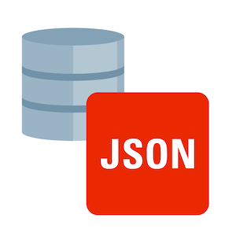
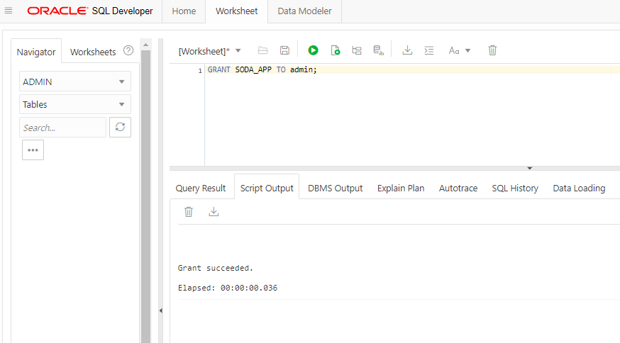
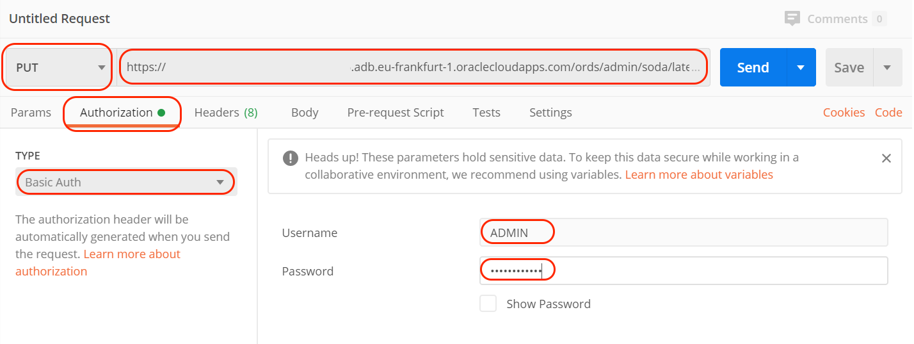
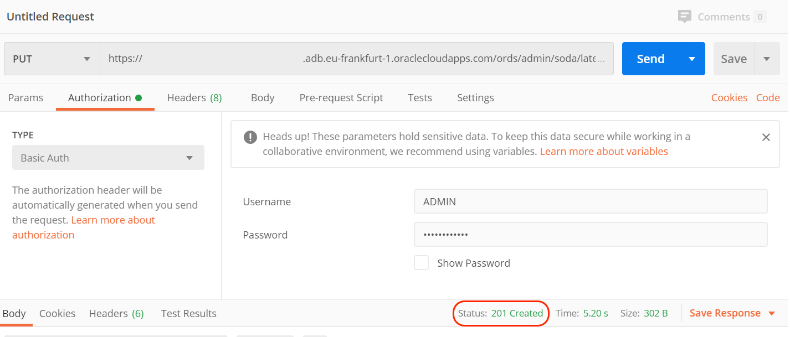
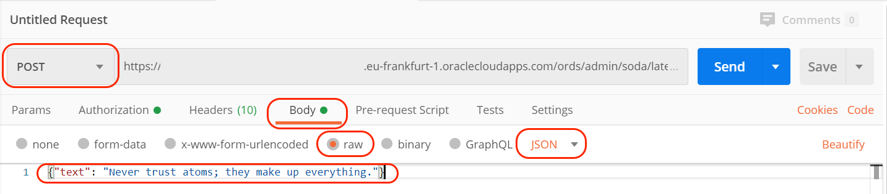
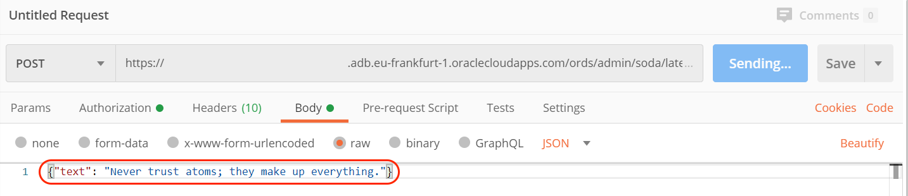
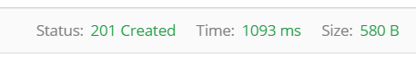
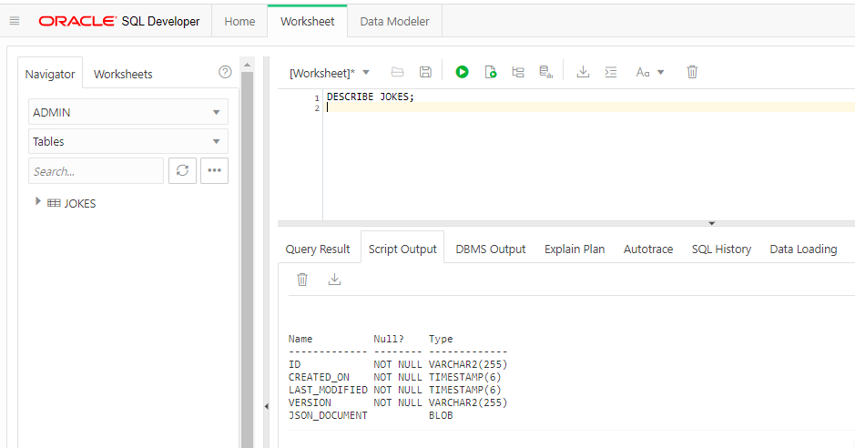
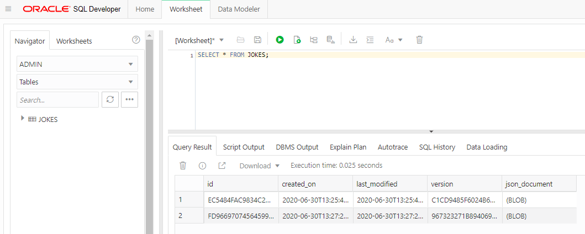

# Lab 2: Create Application and REST API



Each Autonomous Database instance includes Oracle REST Data Services (ORDS) and Simple Object Data Access (SODA) that provides HTTPS interfaces for working with the contents of your Oracle Database in REST enabled schemas.

## Simple Object Data Access (SODA)

Simple Oracle Document Access (SODA) for REST is a pre-deployed REST service that can be used to store JSON documents in an Autonomous Database.

SODA enables flexible, NoSQL-style application development without having to use SQL.

With SODA, JSON documents are stored in named collections and managed using simple CRUD operations (create, read, update and delete). And while SQL isn't required, JSON stored in SODA collections is still fully accessible from SQL when needed.

SODA for REST is deployed in ORDS under the following URL pattern:

`/ords/schema/soda/latest/*`

Where schema corresponds to the REST enabled database schema (for example, "admin").

Feel free to investigate more on the [SODA for REST documentation](https://docs.oracle.com/en/database/oracle/simple-oracle-document-access/rest/index.html)

The first step is to enable `ADMIN` user to use SODA.

Run the following statement on **SQL Developer Web**:

```sql
GRANT SODA_APP TO admin;
```



## Use the REST API

We are going to work with collections that in our case will contain the tasks.

To have access to the SODA REST API, we need to know the endpoint URL of the service. Go to your **Autonomous Transaction Processing** database, in the **Service Console** there is a **Development** section where you can find **RESTful Services and SODA**, copy the URL and save it for later.


We are going to need to install a REST API client. If you are familiar with `curl` go for it, but in this guided steps we are going to use [PostMan](https://www.postman.com/).

Go to the [Postman Download](https://www.postman.com/downloads/) website page.


Run the downloaded file to install Postman.


After a few seconds, we will have Postman up and running:


### Create the collection

Create `tasks` collection with `Postman` by creating a new tab and set the following information:



- `PUT` as method
- SODA URL from the service console (we copy that URL in a previous step). Something like `https://xxxxxxxxxx.adb.yyyyyyyyyyy.oraclecloudapps.com/ords/admin/soda/latest/tasks`
- In Authorization you have to set TYPE as `Basic Auth`
- Username is `ADMIN` and password is the password you set when creating your Autonomous Database.

Click on Send (blue button) on Postman and wait for the response. Confirm you got a Status 201 Created:



> NOTE:
> 
> If you get an error `401 Unauthorized` or similar like this:
> 
> Make sure the `URL`, `username` and `password` are correct.

### Insert elements to the collection

Insert your first element in the collection by:



with body request:

```json
{"text": "Never trust atoms; they make up everything."}
```
Insert your second element in the collection by:



with body request:

```json
{"text": "My wife told me to stop impersonating a flamingo. I had to put my foot down."}
```

In both cases, the response should be a `201 Created`:



## It works

Look at the shape of the table behind SODA.

Go to **SQL Developer Web** and run:

```sql
DESCRIBE tasks;
```



You will see something like this result:

```bash
Name          Null?    Type
------------- -------- -------------
ID            NOT NULL VARCHAR2(255)
CREATED_ON    NOT NULL TIMESTAMP(6)
LAST_MODIFIED NOT NULL TIMESTAMP(6)
VERSION       NOT NULL VARCHAR2(255)
JSON_DOCUMENT          BLOB
```

> NOTE:
> 
> - **ID**: Contains the unique ID for this document.
> - **LAST_MODIFIED**: The date and time of the last update of the document.
> - **CREATED_ON**: The data and time the document was created.
> - **VERSION**: The current version of SODA adopts an optimistic locking strategy to versioning documents.
> - **JSON_DOCUMENT**: The JSON document content created.

Check the content of the table `tasks`.

On **SQL Developer Web** run the following statement:

```sql
SELECT * FROM tasks;
```



How many rows do you see? You should have 2 rows in the table.

Congratulations! You are ready to go to the next Lab!

---

[**<< Prev**](../lab1/README.md) | [home](../README.md) | [**NEXT >>>>>**](../lab3/README.md)
