# Lab 2: Create Application and REST API


Each Autonomous Database instance includes Oracle REST Data Services (ORDS) and Simple Object Data Access (SODA) that provides HTTPS interfaces for working with the contents of your Oracle Database in REST enabled schemas.


In this lab you will create a `tasks` table, REST enabling it, and make the service available for the Custom Component. Normally, you would REST enable database objects in a remote database schema, and then utilize those REST endpoints to define Web Source modules in an application, where APEX is installed, within the local database, as outlined below.


## Create APEX Workspace

In this part of the lab we are creating an APEX workspace. From the Autonomous Database Home page go to **Tools** section and select **Oracle Application Express** area.

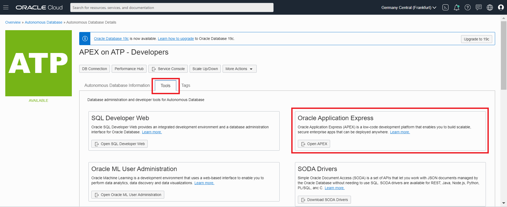

This will open a new browser tab for Application Express Administration.
Login as the Admin user, with the **Admin** password you specified at Autonomous Database creation time.


Create the Lab Workspace
On the Welcome to "Oracle Application Express" page, select **Create Workspace**.

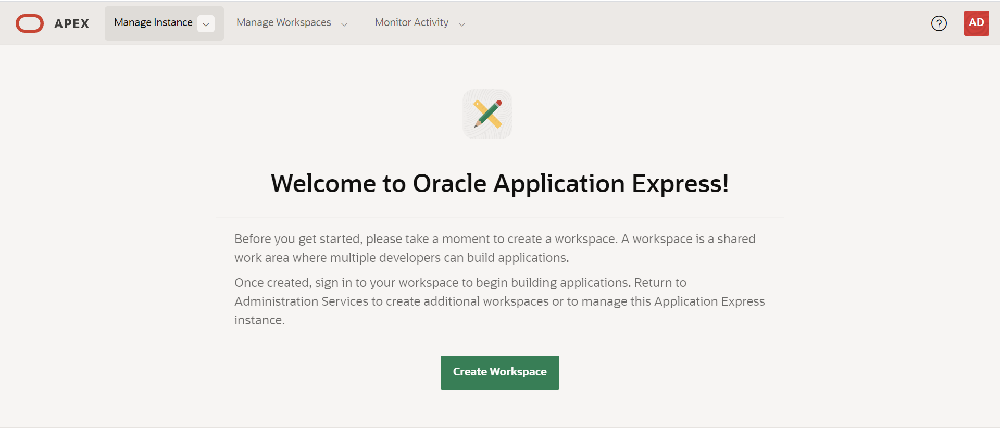

Use the following information to fill out the form:

- **Database User**: ATP_ODA
- **Password**: Any password that meets the Oracle Cloud requirements.
- **Workspace Name**: ATP_ODA

Select **Create Workspace**.

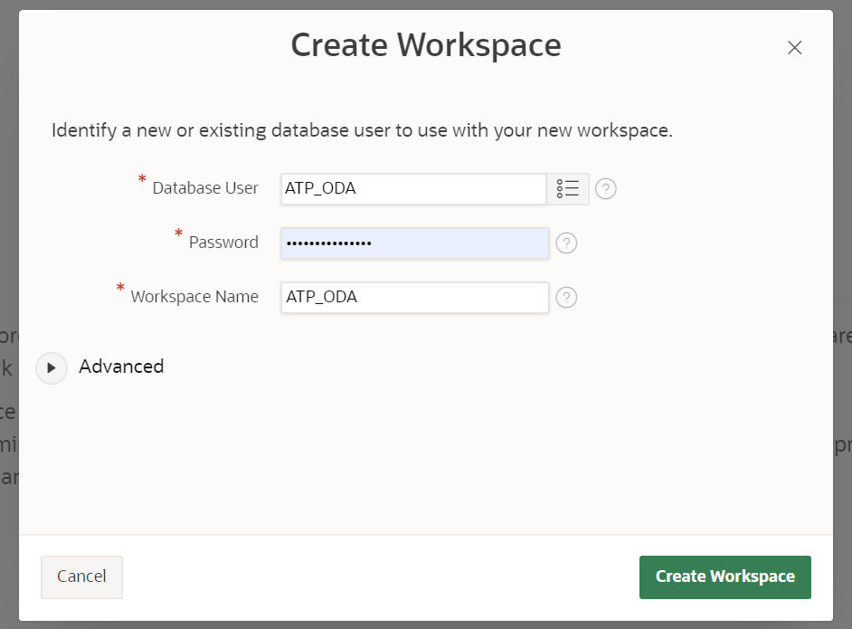

You will be returned to the Oracle APEX administration page, and a message will be displayed "**Workspace Created**".

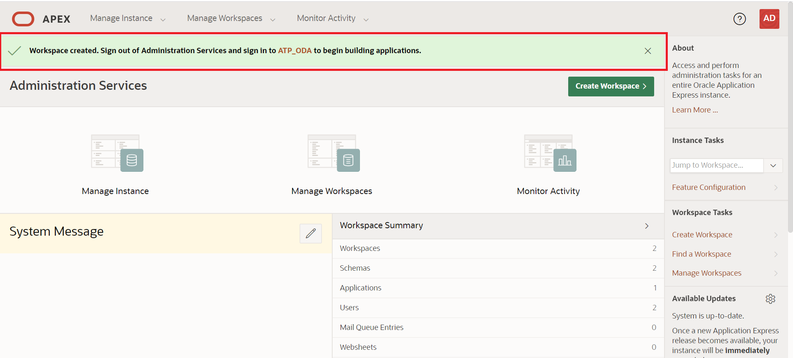

Sign in as the **ATP_ODA** user by selecting the icon on the centre of the screen where you can see the name of the user, **ATP_ODA**.

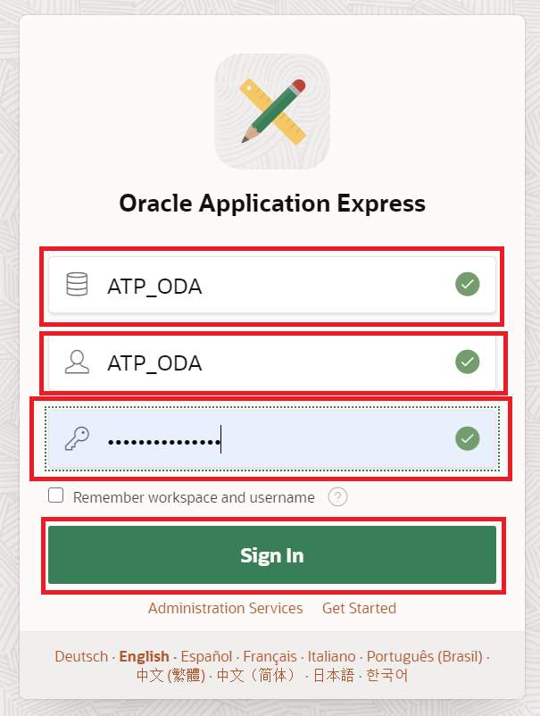

Add the **name of the worspace**, **user name** and **password**: **ATP_ODA** and click **Sing in**.

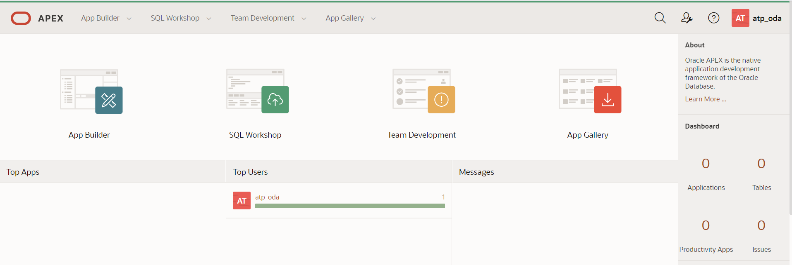

Now we are ready to create your APEX application on this workspace.
You can check that you are correcty sign in with the **ATP_ODA** user in the right up corner.

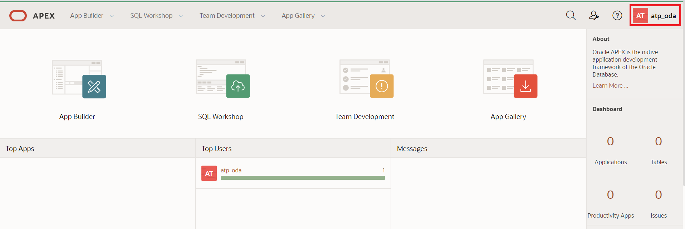

## Create a Table with Quick SQL

TODO intro to Quick SQL

Go to Quick SQL


Write on the left panel the following table definition

```bash
tasks /insert 2
    text vc200
```

Click **Generate SQL**

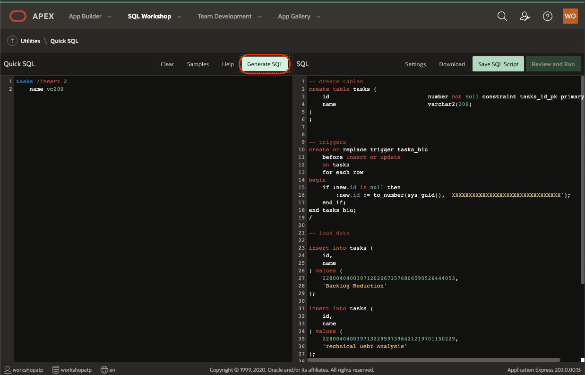

Click **Save SQL Script**

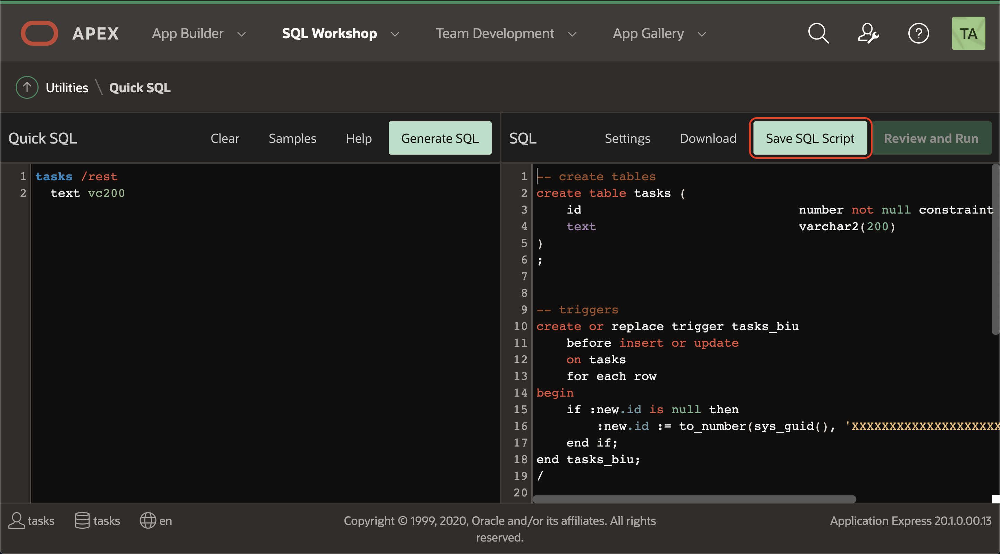

Set the name of the script to `tasks` and confirm **Save Script**


Click **Review and Run**

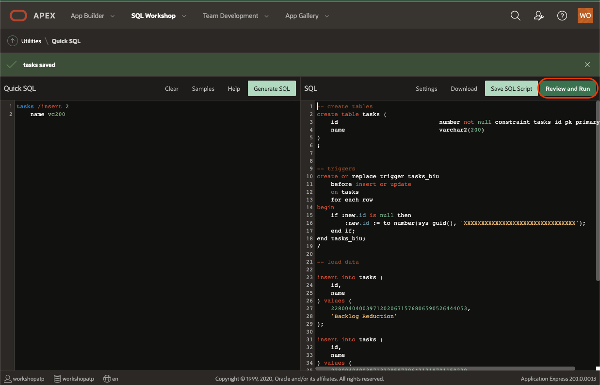

Click **Run**

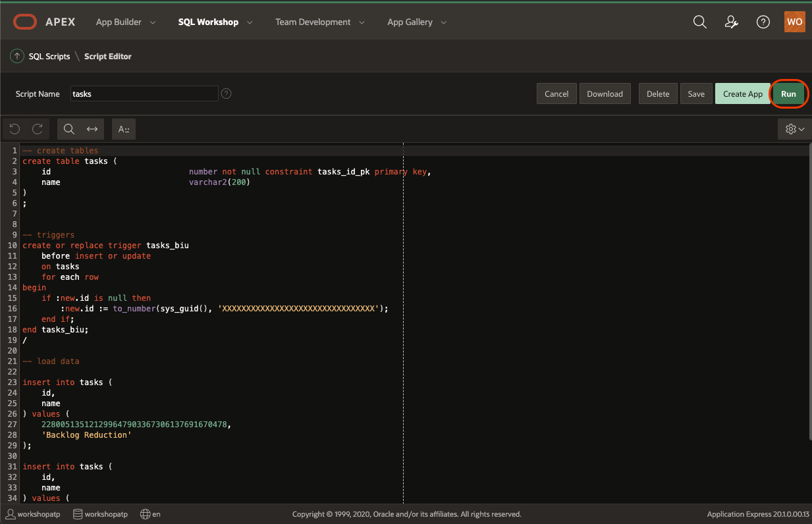

Click **Run Now**


Make sure all statements are successful and no errors happened


## REST Enabling the Database Object

In the main menu, select **SQL Workshop**, click **RESTful Services**.


## Use the REST API

We are going to work with collections that in our case will contain the tasks.

To have access to the SODA REST API, we need to know the endpoint URL of the service. Go to your **Autonomous Transaction Processing** database, in the **Service Console** there is a **Development** section where you can find **RESTful Services and SODA**, copy the URL and save it for later.


We are going to need to install a REST API client. If you are familiar with `curl` go for it, but in this guided steps we are going to use [PostMan](https://www.postman.com/).

Go to the [Postman Download](https://www.postman.com/downloads/) website page.


Run the downloaded file to install Postman.


After a few seconds, we will have Postman up and running:


### Create the collection

Create `tasks` collection with `Postman` by creating a new tab and set the following information:

<details>
    <summary>cURL user, instead of Postman?</summary>
    <p>
        curl -XPUT -u 'ADMIN:<ADMIN_PASSWORD>' '<SODA_URL>/admin/soda/latest/tasks'
    </p>
</details>


- `PUT` as method
- SODA URL from the service console (we copy that URL in a previous step). Something like `https://xxxxxxxxxx.adb.yyyyyyyyyyy.oraclecloudapps.com/ords/admin/soda/latest/tasks`
- In Authorization you have to set TYPE as `Basic Auth`
- Username is `ADMIN` and password is the password you set when creating your Autonomous Database.

Click on `Send` (blue button) on Postman and wait for the response. Confirm you got a Status 201 Created:


> NOTE:
>
> If you get an error `401 Unauthorized` or similar like this:
> 
> Make sure the `URL`, `username` and `password` are correct.

### Insert elements to the collection

Insert your first element in the collection by:

<details>
    <summary>cURL user, instead of Postman?</summary>
    <p>
        curl -XPOST -u 'ADMIN:<ADMIN_PASSWORD>' --data '{"text": "Buy the milk"}' '<SODA_URL>/admin/soda/latest/tasks'
    </p>
</details>


with body request:

```json
{ "text": "Buy the milk" }
```

Insert your second element in the collection by:


with body request:

```json
{ "text": "Walk the dog" }
```

In both cases, the response should be a `201 Created`:


## It works

Look at the shape of the table behind SODA.

Go to **SQL Developer Web** and run:

```sql
DESCRIBE tasks;
```


You will see something like this result:

```bash
Name          Null?    Type
------------- -------- -------------
ID            NOT NULL VARCHAR2(255)
CREATED_ON    NOT NULL TIMESTAMP(6)
LAST_MODIFIED NOT NULL TIMESTAMP(6)
VERSION       NOT NULL VARCHAR2(255)
JSON_DOCUMENT          BLOB
```

> NOTE:
>
> - **ID**: Contains the unique ID for this document.
> - **LAST_MODIFIED**: The date and time of the last update of the document.
> - **CREATED_ON**: The data and time the document was created.
> - **VERSION**: The current version of SODA adopts an optimistic locking strategy to versioning documents.
> - **JSON_DOCUMENT**: The JSON document content created.

Check the content of the table `tasks`.

On **SQL Developer Web** run the following statement:

```sql
SELECT * FROM tasks;
```


How many rows do you see? You should have 2 rows in the table.

Congratulations! You are ready to go to the next Lab!

---

[**<< Go to Lab 1**](../lab1/README.md) | [home](../README.md) | [**Go to Lab 3 >>>>>**](../lab3/README.md)
