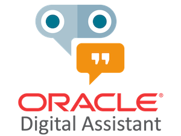
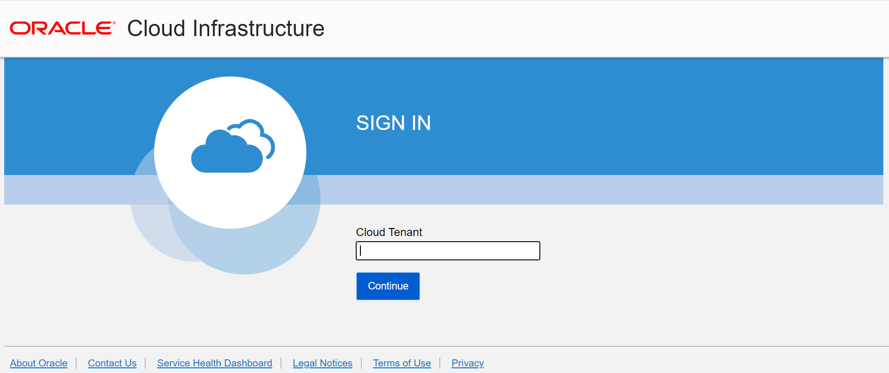
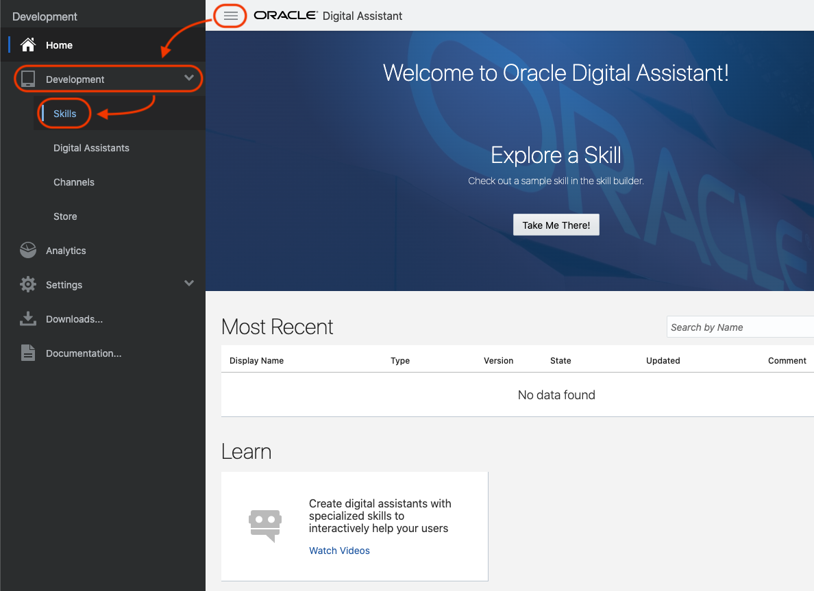

# Lab 3: Create Oracle Digital Assistant

Oracle Digital Assistant is a platform that allows enterprises to create and deploy digital assistants for their users. With Oracle Digital Assistant, you create:

- **Digital assistants**, which are AI-driven interfaces that help users accomplish a variety of tasks in natural language conversations. For each digital assistant, you assemble one or more skills.

- **Skills** (formerly known as chatbots), which are individual bots that are focused on specific types of tasks, such as tracking inventory, submitting time cards, and creating expense reports.

You can add skills to digital assistants or deploy them to a channel on their own.

### Basic Concepts

Before you dive into digital assistant and skill development, here are some concepts you’ll want to get familiar with:

- **Intents**: Categories of actions or tasks users expect your skill to perform for them.

- **Entities**: Variables that identify key pieces of information from user input that enable the skill to fulfill a task.

Both intents and entities are common NLP (Natural Language Processing) concepts. NLP is the science of extracting the intention of text and relevant information from text.

- **Components**: Provide your skill with various functions so that it can respond to users. These can be generic functions like outputting text, or they can return information from a backend and perform custom logic.

- **Dialog Flow**: The definition for the skill-user interaction. The dialog flow describes how your skill responds and behaves according to user input.

- **Channels**: Digital assistants and skills aren’t apps that you download from an app marketplace, like iTunes. Instead, users access them through messaging platforms or through client messaging apps. Channels, which are platform-specific configurations, allow this access. A single digital assistant or skill can have several channels configured for it so that it can run on different services simultaneously.

## Create a Digital Assistant instance

Create a Digital Assistant instance to start working with bots. You can find advance set up steps on the [official documentation](https://docs.oracle.com/en/cloud/paas/digital-assistant/use-chatbot/order-service-and-provision-instance.html#GUID-7E4F1CE5-FB40-45DF-B0F0-949289F5E184).

Go to the Menu and Digital Assistant:

Click on Create Digital Assistant Instance button:

You will have the root compartment selected, or pick the one you want.

Fill the information as in the next image. Developer edition is perfect for this lab and develop new Digital Assistant systems until you want to move to production.

Finally click "Create" button:

Wait for the instance to be "Active". The creation process will take a few minutes.
Once the instance is Active, then on the instance menu, click on "Service Console":

You will have to log-in again with your account name and your user and password.

Type your account name:

And then click in **Continue** on the **Single Sign-On (SSO)** side:

Introduce your username and password and you are ready to visit Oracle Digital Assistant Home page.

You will be on the Oracle Digital Assitant Dashboard where you can start building your bots.

## Explore your Digital Assistant

You can always **Watch Videos** on the **Learn** section at the bottom and explore the documentation of Oracle Digital Assitant by following the links on the dashboard.

## It works

Make sure you look around and feel familiar with the menus.

Congratulations! You are ready to go to the next Lab!

---

[**<< Prev**](../lab2/README.md) | [home](../README.md) | [**NEXT >>>>>**](../lab4/README.md)
