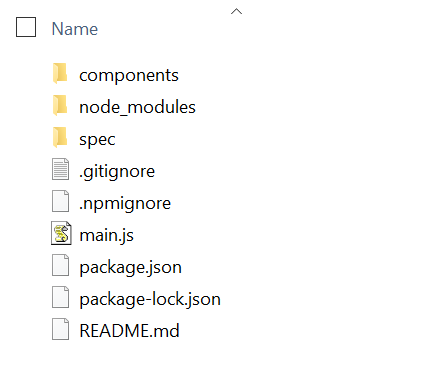
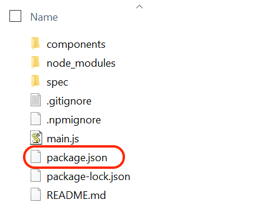
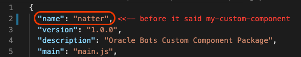
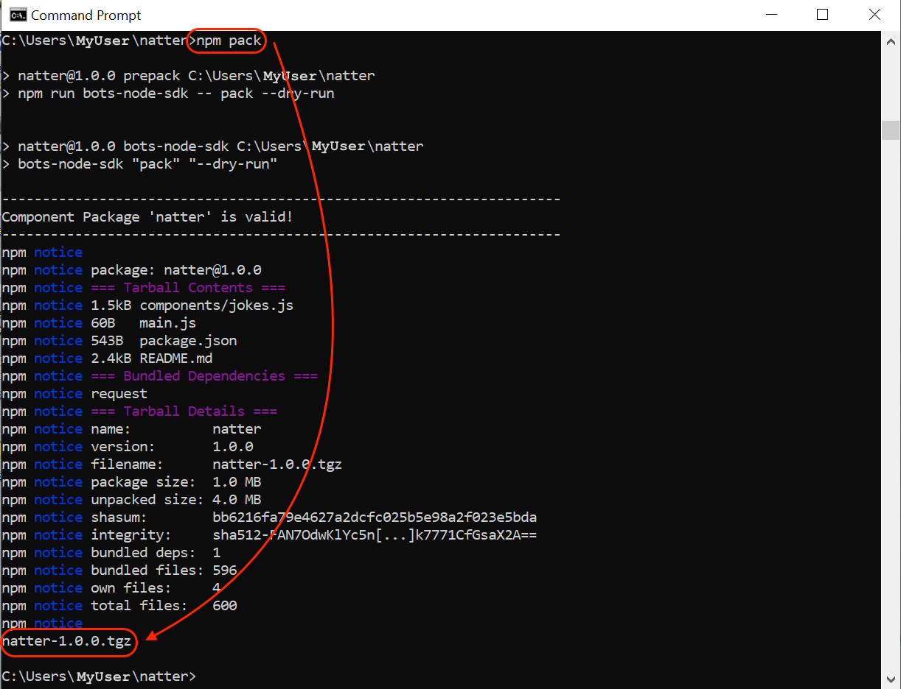
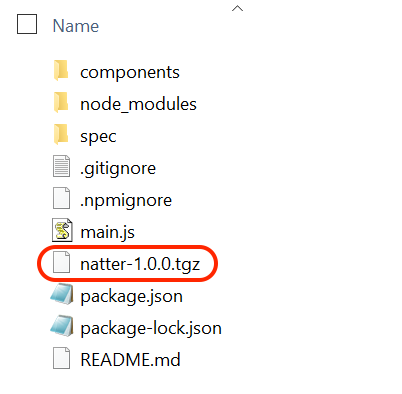

# Lab 4: Implement Custom Component

**Oracle Digital Assistant** allows you to build integrations with backend services by creating **Custom Components**.

Custom Components are a bridge between **Skills** on Oracle Digital Assistant and the **Services** where information can be fetched.


Custom components allow you as well to plug-in custom code logic into a bot conversation.

That is exactly what we are going to build.

**Custom Components** are developed using **Node.js**. They are just a REST **API** that offer an endpoint to **Skills** bots to `GET` and `POST` actions.


You can package related **Custom Components** together.

## Create a Custom Component to integrate with backend services

Oracle provides **Oracle Bots Node.js SDK**, a free utility that makes custom components development very easy.

> We had explained the instalation steps in the Pre-requisites section at the very begining of this lab.

Ready to create your **Custom Component** scaffolding.

Open a **terminal** and type:

```bash
npx @oracle/bots-node-sdk init tasks-cc --component-name tasks
```

Where `tasks-cc` is the name of the custom component module. And `tasks` is the name of our first custom component implementation.

The **result** should look like this:

```bash
---------------------------------------------------------------------
Custom Component package 'tasks-cc' created successfully!
---------------------------------------------------------------------

Usage:

  cd tasks-cc
  npm start    Start a dev server with the component package
```

> NOTE:
>
> A new folder `tasks-cc` was created with this hierarchy inside:
>
> 
>
> Note you have a `package.json` file and a `components` folder with a file `tasks.js` inside.

**Change directory** to `tasks-cc` on the Command Prompt or Terminal:

```bash
cd tasks-cc
```

This custom component is going to make REST API calls to fetch information from APEX. To do so, we need to install an extra library called [node-fetch](https://www.npmjs.com/package/node-fetch).

Install the library with the following command:

```bash
npm install node-fetch
```

Edit the file `package.json` in `tasks-cc` folder. You can use your favorite text editor. My choice is [Visual Code](https://code.visualstudio.com/) but feel free to use any. Even Notepad for those Windows user that don't want to install anything else.



We have to **change the name** of the package from the generic `my-custom-component` to something more personalized like `tasks-cc`. Check line number 2:



**Save** the file with the changes.

Great, we are now ready to **change the code** of our **custom component implementation**.

Open the file `tasks.js` with your favourite text editor. You can find this file in the **Components folder**.

Edit the file `tasks.js` and **replace** the whole content with the following code:

PRISCILA -----

```javascript
"use strict";

const fetch = require("node-fetch");

const ordsURL = "<SODA_URL>/ords";
const collection = "tasks";

const username = "ADMIN";
const password = "<ADMIN_PASSOWRD>";
const authString = `${username}:${password}`;

function getTasks(urlRequest, logger, callback) {
  logger.info(urlRequest);
  fetch(urlRequest)
    .then((res) => {
      if (!res.ok) {
        const errorMessage = `Invalid status ${res.status}`;
        logger.error(errorMessage);
        callback(errorMessage);
        throw new Error(errorMessage);
      }
      return res.json();
    })
    .then((body) => {
      callback(null, body.items);
    })
    .catch((err) => {
      logger.error(err.message);
      callback(err.message);
    });
}

module.exports = {
  metadata: () => ({
    name: "com.example.tasks",
    supportedActions: ["success", "failure"],
  }),
  invoke: (conversation, done) => {
    const urlRequest = `https://${authString}@${ordsURL}/${username.toLowerCase()}/soda/latest/${collection}`;
    getTasks(urlRequest, conversation.logger(), (err, items) => {
      if (err) {
        conversation.transition("failure");
        done();
        return;
      }
      const values = items.map((item) => item.value);
      const tasks = values.map((v) => v.text);
      conversation.reply(tasks.join("\n")).transition("success");
      done();
    });
  },
};
```

IMPORTANT:

Remember to change the `<SODA_URL>` and `<ADMIN_PASSOWRD>` for the values as we have done in lab 2.

It should look like this:

```javascript
  5 const ordsURL = "GFHWWOU5XPCXAQ-ATPWORKSHOP.adb.uk-london-1.oraclecloudapps.com/ords";
  6 const collection = "tasks";
  7
  8 const username = "ADMIN";
  9 const password = "Str0ngP4$$w0rd!";
```

## Deploy the custom component

Custom Components can be deployed in different ways:

- **Local Component Container**: single instance deployment as custom component resides in skill bot
- **Mobile Hub**: multi-channel environment with mobile extras and shared instance deployment.
- **Node Container**: shared instance but no need for mobile extras.

We are going to **install** our custom component **locally** as a **component container**. Very simple, we need to pack our code in a single file that contains everything:

Package your **Custom Component** by running on your Command Prompt or Terminal:

```bash
npm pack
```

The output looks like this:



## It works

There will be a new file in your `tasks-cc` folder called `tasks-cc-1.0.0.tgz`.



## Congratulations! You are ready to go to the next Lab!

---

[**<< Go to Lab 3**](../lab3/README.md) | [Home](../README.md) | [**Go to Lab 5 >>>>>**](../lab5/README.md)
