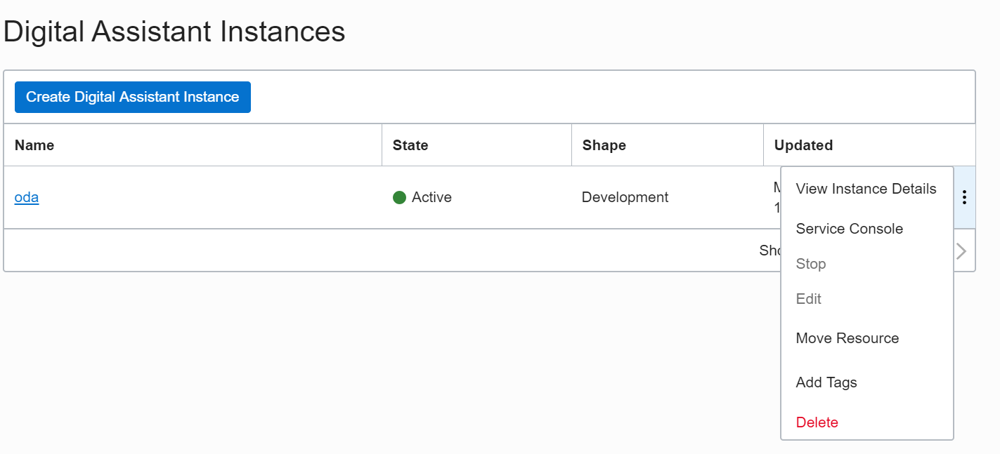
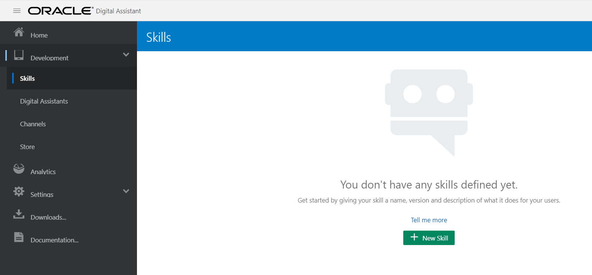
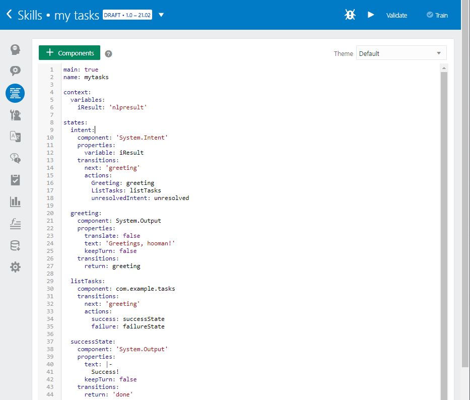
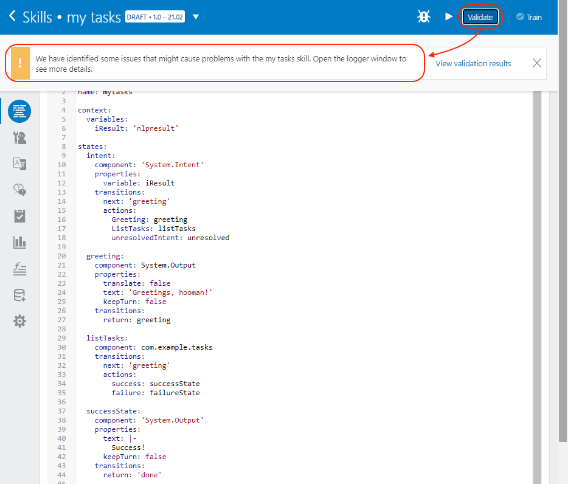
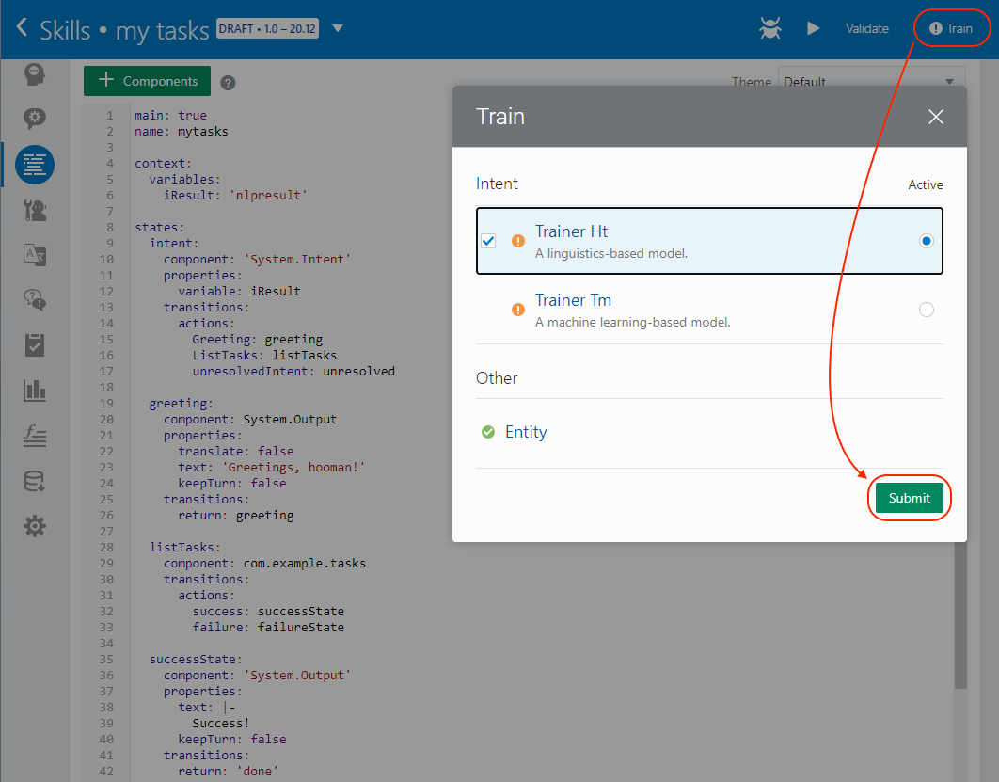
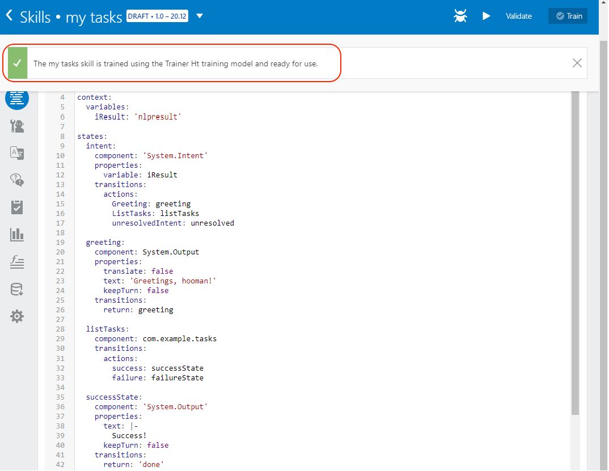
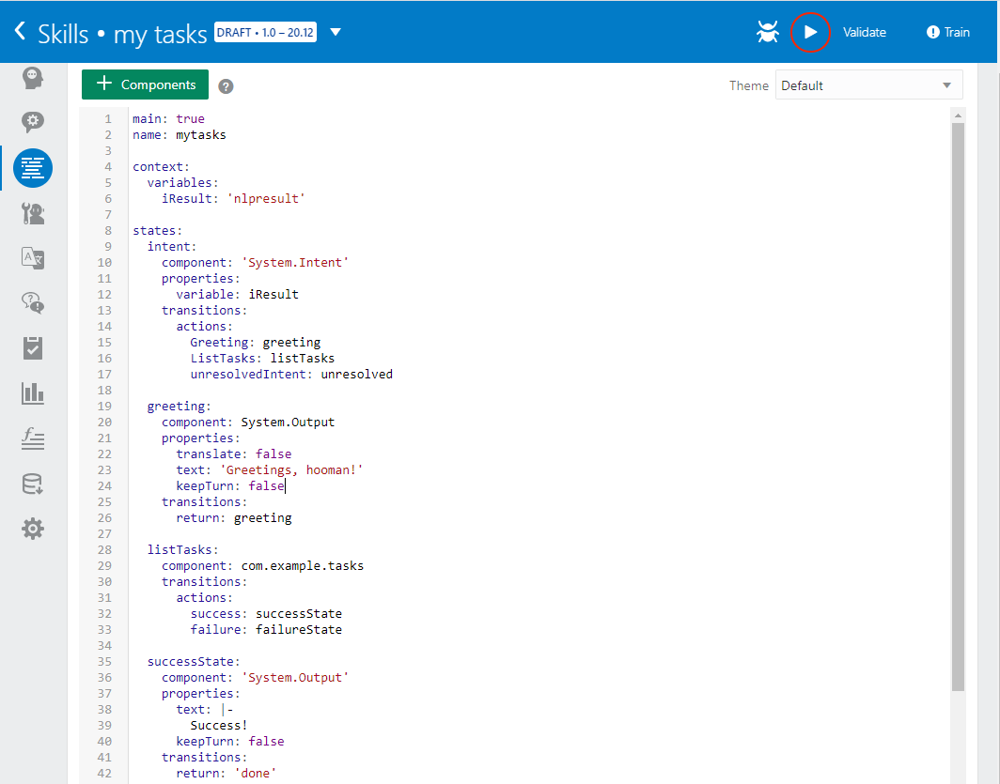
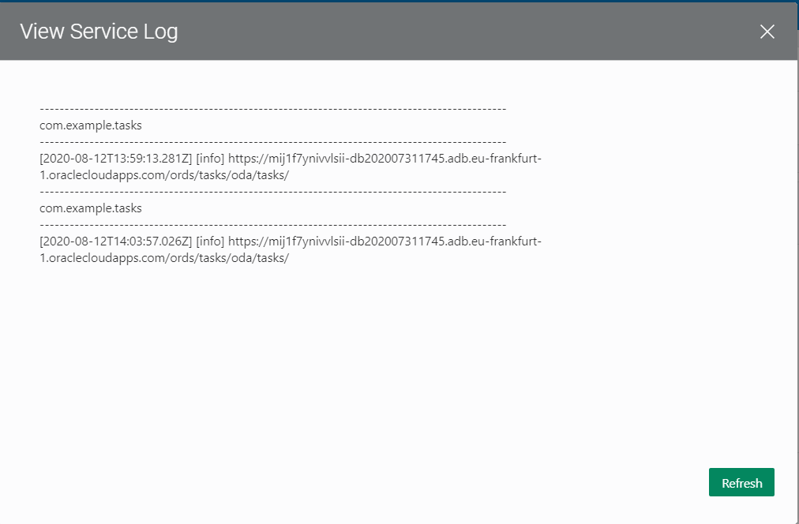

# Lab 5: Create Digital Assistant Skill

**Digital assistants** consist of one or more **skills**, which are individual **chat bots** that are focused on specific types of tasks.

You will create a **skill** that can be used for interactions with a backend service, using the **Custom Component** you built on previous lab.

As part of this process, you will:

- **Create** a new skill.
- **Import** your Custom Component (the `tgz` file you generated with `npm pack`).
- **Create** two intents: `Greeting` and `ListTasks`.

We have to access to **Digital Assistant** section in the **Oracle Cloud Dashboard**.


Go to **Digital Assistant Dashboard** as we did on **Lab 3**. As a reminder check the following screenshot:

.

## Build your first Skill

In this lab, we're starting from scratch. So the first thing you'll do is **create** a new skill.

**Click** on `+ New Skill` button to start:



**Fill** the information and click **Create** button:
- **Display Name**: My tasks
- **Name**: mytasks


---

## Import the Custom Component

Importing a Custom Component is very simple.

**Go** to the **Components** view  on the left menu. Select `+ Service`.


The pop-up web form to **upload** the file will be shown.

We will fill out all the information of this web form.

Select `Upload a component package file (a .tgz file created by running bots-node-sdk pack or npm pack) or drag it here.`


**Upload** `tasks-cc-1.0.0.tgz` file that we created before. Remember that the tgz file is on the tasks-cc folder.


**Fill** the rest of the information and remember to `Enable Component Logging` with the toggle button

- **Name**: tasks
- **Description**: Tasks Custom Component
- **Embedded Container** is selected by default. Leave it like that.
- **Enable Component Logging**: set to on

Finally **Create** the Service.


**Wait** for the deployment to be ready.


**Make sure** the `Status` is `Ready`. You see all the **information** on this page like in this screenshot.


---

## Create intents

Oracle Digital Assistant's underlying **Natural Language Processing (NLP)** engine doesn't inherently know about the business or task that a skill is supposed to assist with. For the skill to understand what it should react to, you need to define intents and examples (utterances) for how a user would request a specific intent.

Let's create a **Greeting Intent**.

**Go** to the **Intent** view  on the left menu. Select `+ Intent`.


We will start working on the **Intent** page. The page by default looks like this screenshot:


**Modify** default values for:

- **Conversation Name**: Greeting
- **Name**: Greeting
- **Utterances to Add**: In this field is where you have to type in the different Greetings that you want to include as part of the Intent. Type `hi` in this field  and click enter. Wait for it to be added as part of the intents. Type on the same field `hello` and wait for it to be added as before.

The two **Intents** that you added a few seconds ago will be visible in the page. Check the following screenshot to confirm.


**Click** on `+ Intent` on the same screen to add more Intents to the conversation.


**Modify** default values for:

- **Conversation Name**: ListTasks
- **Name**: ListTasks
- **Utterances to Add**: In this field is where you have ti type the different list of tasks that you want to include as part of the Intent. Type on this field `list my tasks` and click enter. Wait to be added as part of the intents. Type on the same field `show me my tasks` and wait for it to be added as before. And finally type on the same field `tasks` and wait for it to be added as before.

The three **Intents** that you added a few seconds ago will be visible in the page. Check the following screenshot to confirm.


## Put everything together

Time to **integrate** your **Custom Component with the Intent** `ListTasks` created before.

**Go** to the **Flows** view  on the left menu.

You will **see** the `YAML` file that defines the behavior of your **Skill**.


**Delete** the full content of the **Flows** section and leave the canvas **empty**.


This flow includes the 2 **intents**  you defined earlier, and also an unresolved action to carry out if the digital assistant cannot match the user's input to an existing **intent**.


**Copy** this `YAML` content:

```yaml
main: true
name: mytasks

context:
  variables:
    iResult: 'nlpresult'

states:
  intent:
    component: 'System.Intent'
    properties:
      variable: iResult
    transitions:
      next: 'greeting'
      actions:
        Greeting: greeting
        ListTasks: listTasks
        unresolvedIntent: unresolved

  greeting:
    component: System.Output
    properties:
      translate: false
      text: 'Greetings, hooman!'
      keepTurn: false
    transitions:
      return: greeting

  listTasks:
    component: com.example.tasks
    transitions:
      next: 'greeting'
      actions:
        success: successState
        failure: failureState

  successState:
    component: 'System.Output'
    properties:
      text: |-
        Success!
      keepTurn: false
    transitions:
      return: 'done'

  failureState:
    component: 'System.Output'
    properties:
      text: |-
        Failed! Check the logs.
      keepTurn: false
    transitions:
      return: 'done'

  unresolved:
    component: System.Output
    properties:
      translate: false
      text: "I don't understand. What do you want to do?"
      keepTurn: false
    transitions:
      return: unresolved
```

<!-- TODO Explain every part of the Flows definition.-->

Your **Flows** section should look like this one:



**Make sure** the syntax is correct. **Click** on the `Validate` button. You will get a warning message **We have identified some issues that might cause problems with the my tasks skill. Open the logger window to see more details.** on the top of the page as you can see on the image below. You can explore the warning on **View validation results** section to learn. We can proceed with next steps.



Click **Train** button to run the **Machine Learning Algorithm**. Select **Trainer Ht** and select **Submit**.



**Be sure** that you get the green tick and a **ready to use** confirmation on the top of the page as you can see on the image below:



Test your skill by clicking the `Play` button next to `Validate`.



The way to test the conversation is typing any of the **Intents** that we have created on this Lab5.

For example: say `hi` and wait for the bot to answer. In this case the answer is `Greetings, hooman!`. Type the next Intent `show me my tasks` and wait for the bot to answer. Now the answer is `Get concert tickets` and `Buy bread`.


> NOTE:
>
> If you see an **error message** at this point, it means there is a **problem** with the **Custom Component Code**.
>
> To get more information about the issue, check the logs.
>
> Go to **Components** view  on the left menu and **click** on **Diagnostics** for your **Custom Component**, then on **View Logs**.
>
> 
>
> The **result** should be something like this:
> 

---

## It works!

To demonstrate that the task list is being  **requested** from the **database**, we can **add** a new task item.

**Insert** your third element in the collection of data by going to **APEX** and on the Top Menu select the **SQL Workshop** drop down menu, click **Object Browser** as we did during **Lab 2**:


Select **TASKS** table on the left of the APEX page and **click** the tab **Data**, then click **Insert Row**:


**Add** a new **Text** like `New item!` and **click** **Create**:


**Confirm** the row has been created:


**Run** the chat again, first selecting to **reset** the previous **conversation**.

For example: reset the conversation by clicking on **Reset** then say `hi` and wait for the bot answer. Type the next Intent `show me my tasks` and wait for the bot answer. Now the answer is `Get concert tickets`, `Buy bread`, and `New Item!`.


# Congratulations! Well done!

Continue to the Next Steps for more information!

---

[**<< Go to Lab 4**](../lab4/README.md) | [Home](../README.md) | [**Next Steps >>>>>**](../next/README.md)
