# Lab 5: Create Digital Assistant Skill

**Digital assistants** consist of one or more **skills**, which are individual **chat bots** that are focused on specific types of tasks.

You will create a **skill** that can be used for interactions with a backend service, using the **Custom Component** you built on previous lab.

As part of this process, you will:

- **Create** a new skill.
- **Import** your Custom Component (the `tgz` file you generated with `npm pack`).
- **Create** two intents: `Greeting` and `ListTasks`.

## Build your first Skill

In this lab, we're starting from scratch. So the first thing you'll do is **create** a new skill.

Click on `+ New Skill` button to start:


Fill the information like in the image and click **Create** button:


---

## Import the Custom Component

Import Custom Component is very simple.

**Go** to the **Components** view  on the left menu.


The web form to upload the file will **show up**.


**Upload** `tasks-cc-1.0.0.tgz` file.


**Fill** the information and remember to `Enable Component Logging` with the toggle button.


**Wait** for the deployment.


**Make sure** the `Status` is `Ready` and you see all the information like in this screenshot.


---

## Create intents

Oracle Digital Assistant's underlying **Natural Language Processing (NLP)** engine doesn't inherently know about the business or task that a skill is supposed to assist with. For the skill to understand what it should react to, you need to define intents and examples (utterances) for how a user would request a specific intent.

**Create** Greeting intent, click **+ Intent**:

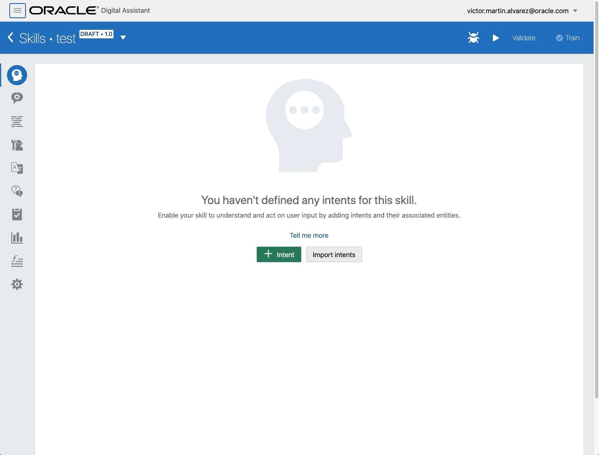

**Modify** default values.

<!-- TODO -->

Utterances:

- `hi`
- `hello`


For `Greeting` intent.

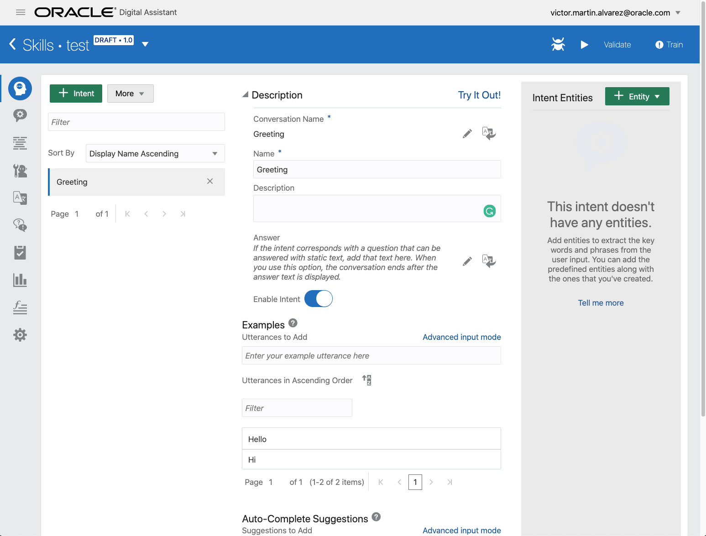

**Click** on `+ Intent` on the same screen.


**Modify** default values for `ListTasks` intent.

<!-- TODO -->

Utterances:

- `tasks`
- `show me my tasks`
- `list my tasks`

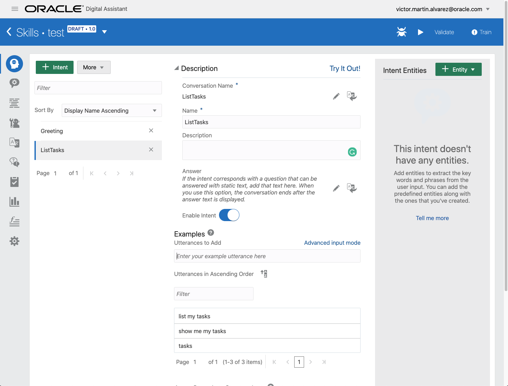

## Put everything together

Time to **integrate** your **Custom Component with the Intent** `ListTasks` created before.

On the left menu, you will find the **Flows** entry with this icon:


You will see the `YAML` file that define the behaviour of your **Skill**.


**Delete** the initial content.


**Replace** it with:

```yaml
metadata:
  platformVersion: '1.1'
main: true
name: mytasks

context:
  variables:
    iResult: 'nlpresult'

states:
  intent:
    component: 'System.Intent'
    properties:
      variable: iResult
    transitions:
      actions:
        Greeting: greeting
        ListTasks: listTasks
        unresolvedIntent: unresolved

  greeting:
    component: System.Output
    properties:
      translate: false
      text: 'Greetings, hooman!'
      keepTurn: false
    transitions:
      return: greeting

  listTasks:
    component: com.example.tasks
    transitions:
      actions:
        success: successState
        failure: failureState

  successState:
    component: 'System.Output'
    properties:
      text: |-
        Success!
      keepTurn: false
    transitions:
      return: 'done'

  failureState:
    component: 'System.Output'
    properties:
      text: |-
        Failed! Check the logs.
      keepTurn: false
    transitions:
      return: 'done'

  unresolved:
    component: System.Output
    properties:
      translate: false
      text: "I don't understand. What do you want to do?"
      keepTurn: false
    transitions:
      return: unresolved
```

**XXX** Explain every part of the Flows definition.

It should look like:


**Make sure** all the syntax is correct on the flow by clicking `Validate` button.

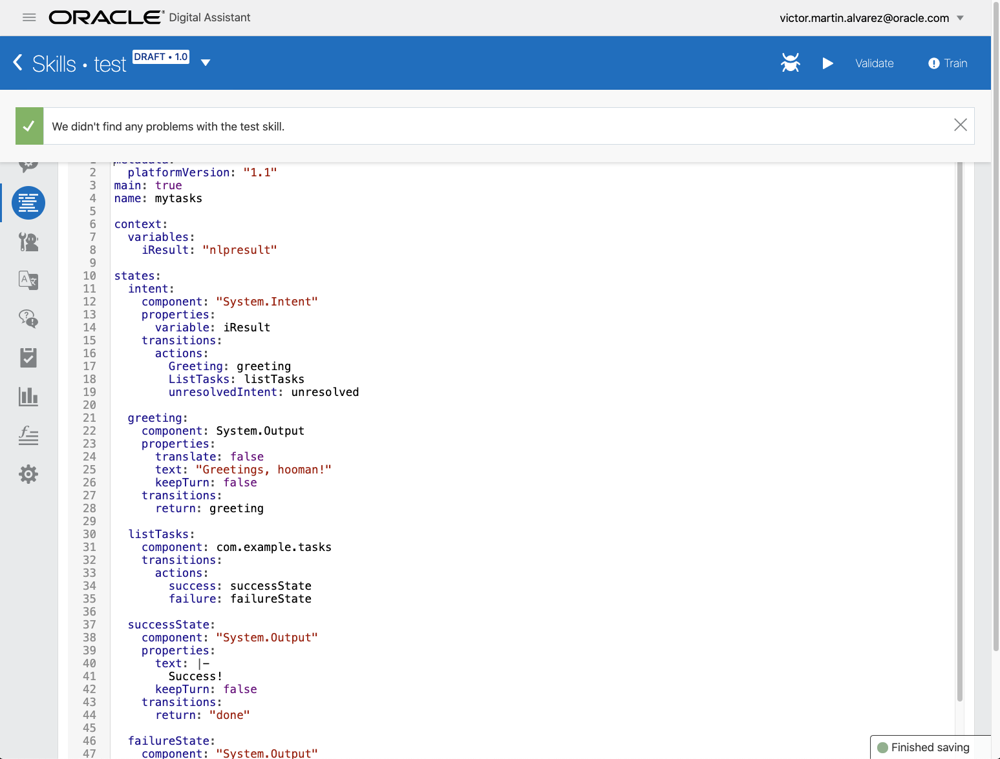

Click **Train** button to run the machine learning algorithm.

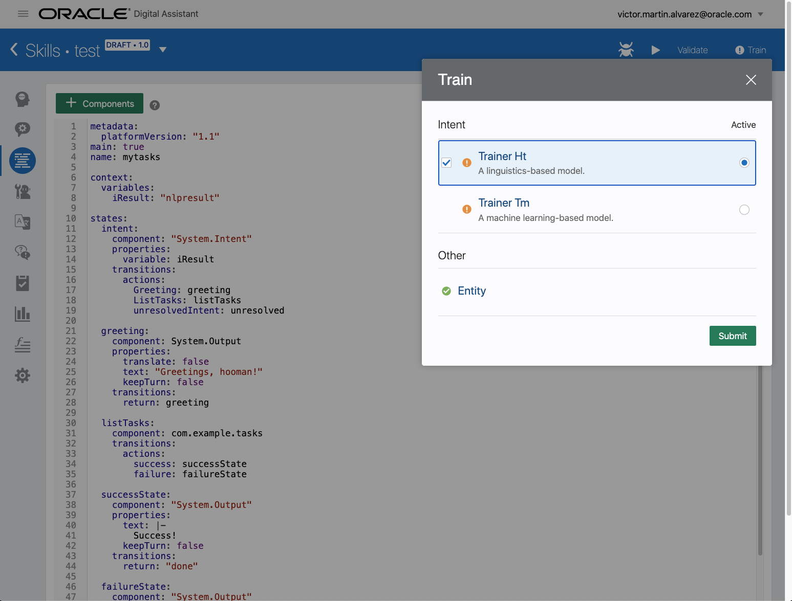

**Wait** for the confirmation.

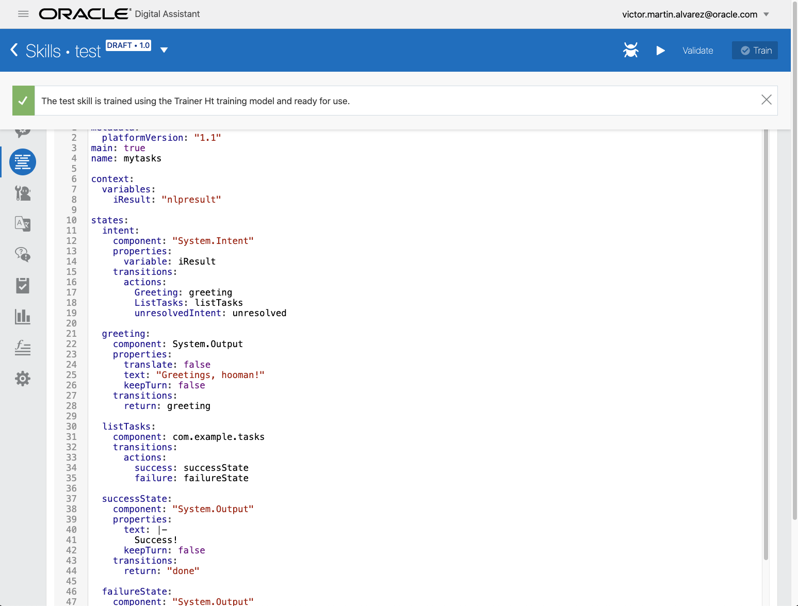

**Run** the test of the skill:

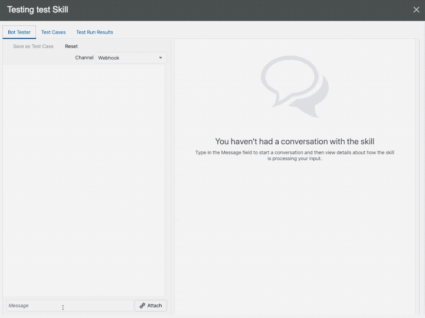

> NOTE:
>
> If you see an error message at this point, it means there is a problem with the custom component code.
>
> To get more information about the issue, check the logs.
>
> Go to Components  on the left menu and click on Diagnostics for your Custom Component, then on **View Logs**.
>
> 

## It works

To see how we request against the database we can add a new item.

**Insert** your third element in the collection by going to APEX and on the Top Menu on **SQL Workshop**, click **Object Browser**:


Select **TASKS** table on the left and click the tab **Data**, then click **Insert Row**:


**Add** a new **Text** like `New item!` and **click** **Create**:


**Confirm** the row has been created:

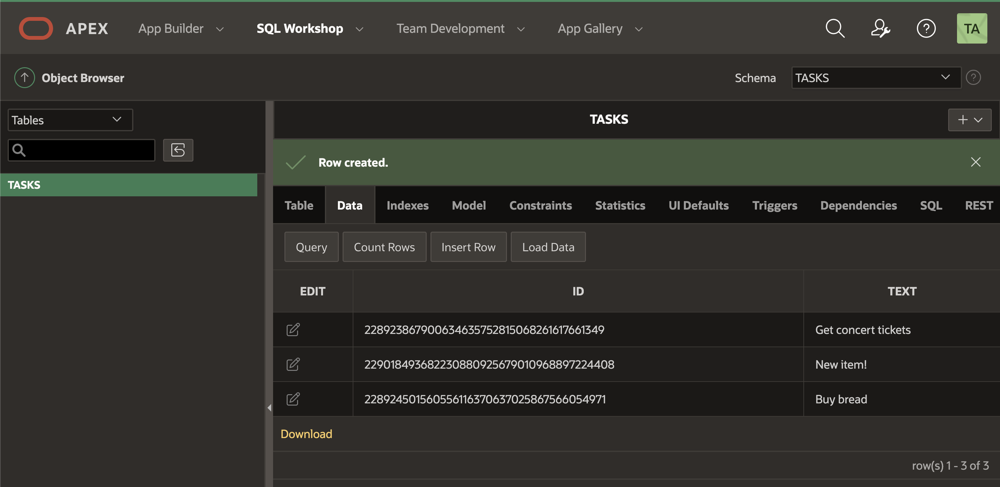

**Run** the chat again and reset the previous conversation.

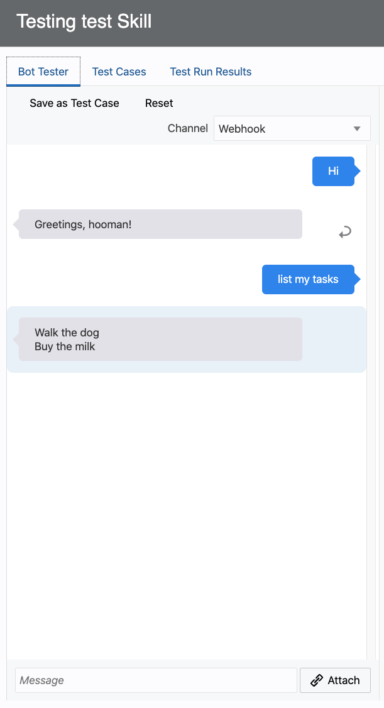

**Type** `show me my tasks`:

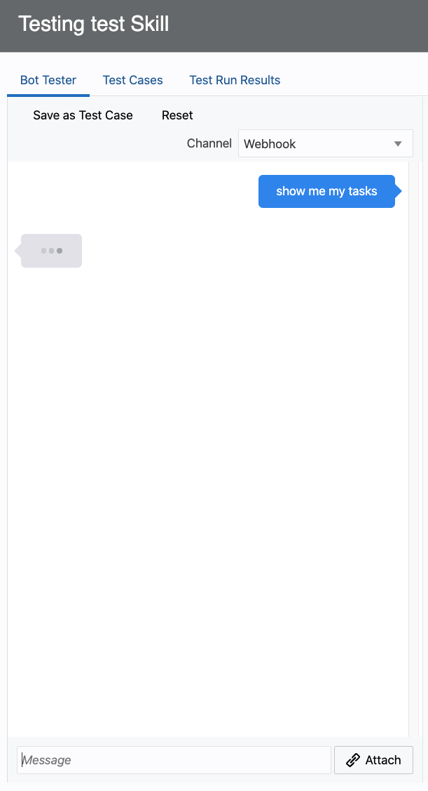

**Check** the result.

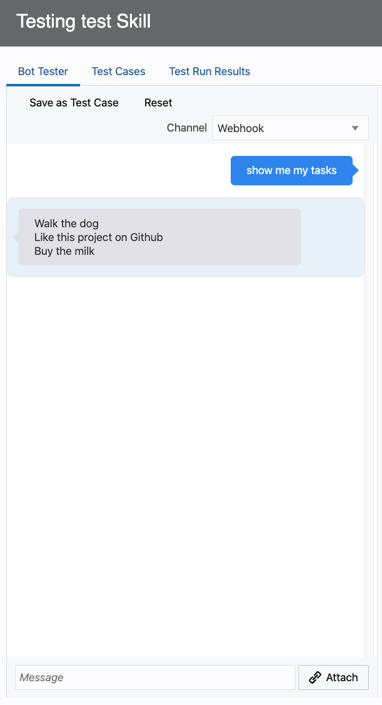

# Congratulations! Well done!

Continue to the Appendix for more information!

---

[**<< Go to Lab 4**](../lab4/README.md) | [Home](../README.md) | [**Go to APPENDIX >>>>>**](../appendix/README.md)
