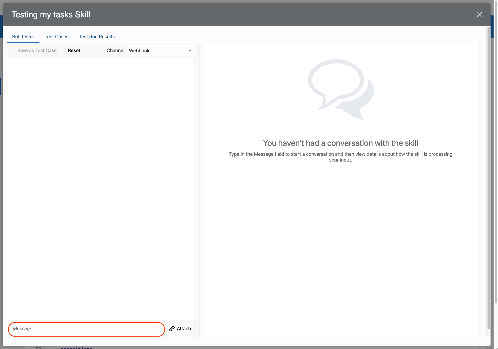
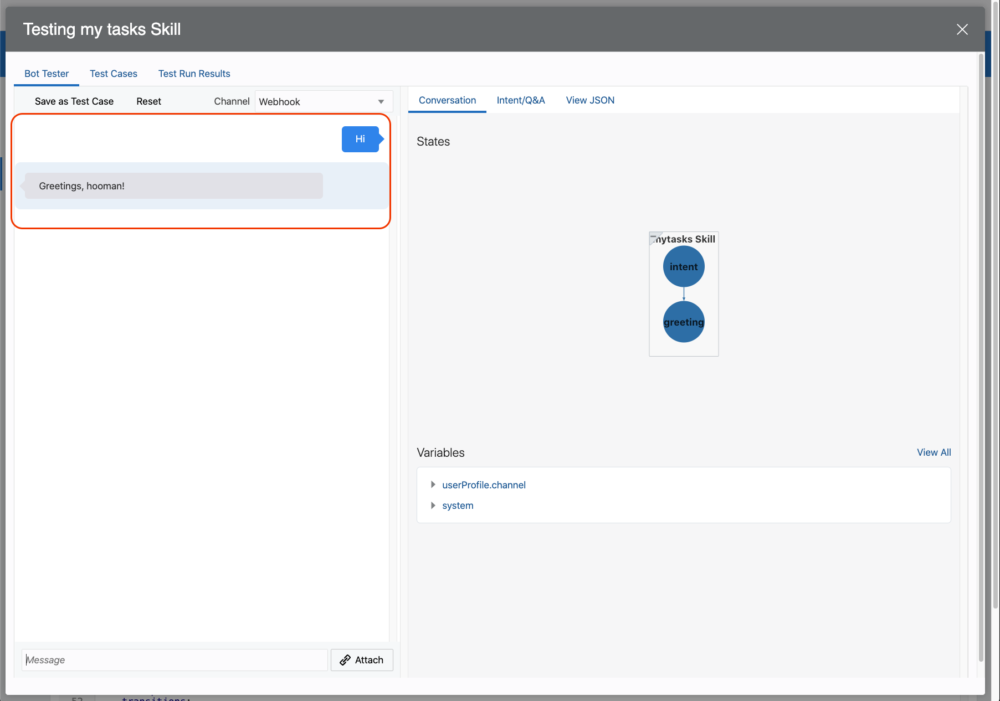
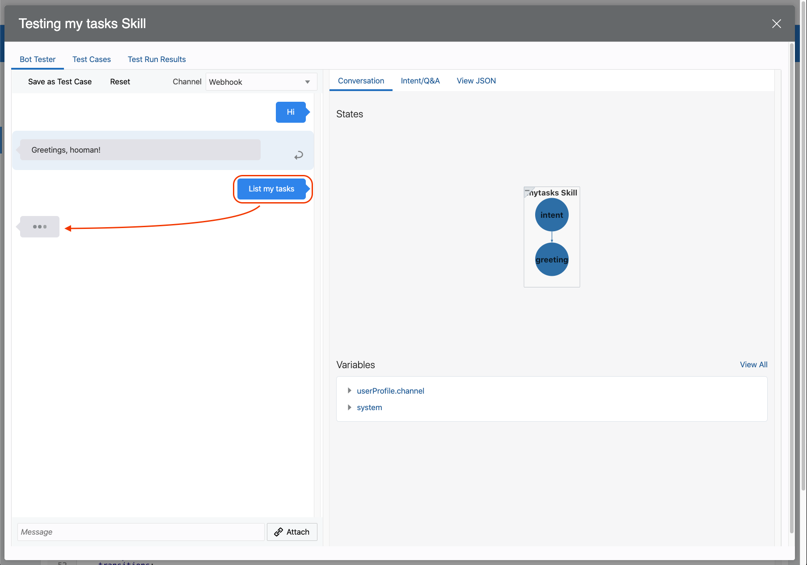
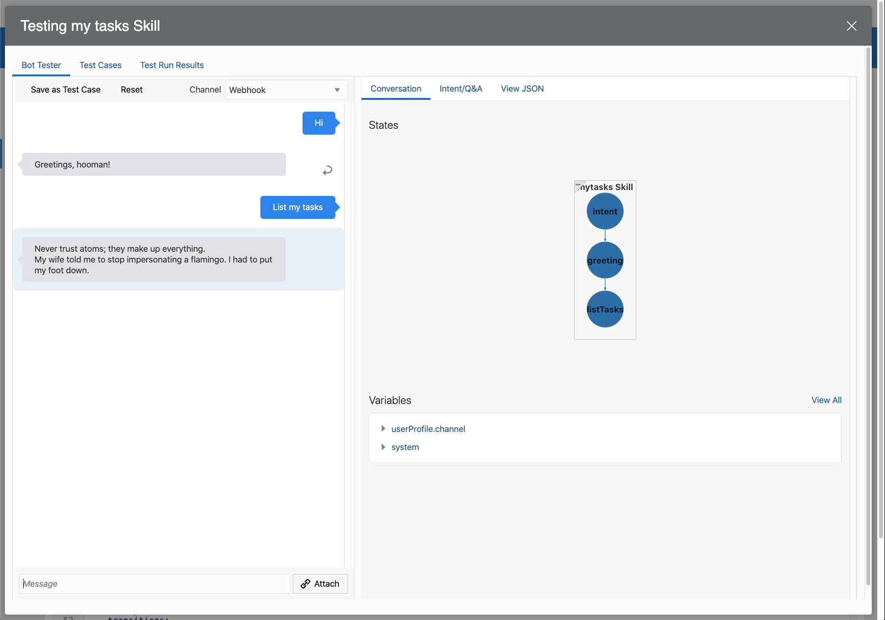

# Lab 5: Create Digital Assistant Skill

**XXX** Intro

## Build your first Skill

**XXX** Create Skill

Click on `+ New Skill` button to start:


Fill the information like in the image and click `Create` button:


---

Import Custom component is very simple.

Go to the Components view  on the left menu


The web form to upload the file will show up


Upload `tasks-cc-1.0.0.tgz` file


Fill the information and remember to `Enable Component Logging` with the toggle button.


Wait for the deployment


Make sure the `Status` is `Ready` and you see all the information like in this screenshot


---

**XXX** Create Greeting intent

**XXX** Create ListTasks intent

## Put everything together

Time to integrate your Custom Component with the Intent `ListTasks` created before.

On the left menu, you will find the Flows entry with this icon:


Delete the initial content and replace it with:

```yaml
metadata:
  platformVersion: "1.1"
main: true
name: mytasks

context:
  variables:
    iResult: "nlpresult"

states:
  intent:
    component: "System.Intent"
    properties:
      variable: iResult
    transitions:
      actions:
        Greeting: greeting
        ListTasks: listTasks
        unresolvedIntent: unresolved

  greeting:
    component: System.Output
    properties:
      translate: false
      text: "Greetings, hooman!"
      keepTurn: false
    transitions:
      return: greeting

  listTasks:
    component: com.example.tasks
    transitions:
      actions:
        success: successState
        failure: failureState

  successState:
    component: "System.Output"
    properties:
      text: |-
        Success!
      keepTurn: false
    transitions:
      return: "done"

  failureState:
    component: "System.Output"
    properties:
      text: |-
        Failed! Check the logs.
      keepTurn: false
    transitions:
      return: "done"

  unresolved:
    component: System.Output
    properties:
      translate: false
      text: "I don't understand. What do you want to do?"
      keepTurn: false
    transitions:
      return: unresolved
```

**XXX** Explain every part of the Flows definition

**XXX** Validate

**XXX** Train

**XXX** Test

Run the test of the skill:



Say `Hi` and wait for the response:



Say `List my tasks` and wait:



The list of tasks will be replied from the bot:



> NOTE:
>
> If you see an error message at this point, it means there is a problem with the custom component code.
>
> To get more information about the issue, check the logs
>
> Go to Components  on the left menu and click on Diagnostics for your Custom Component, then on View Logs
>
> 

## It works

**XXX** Insert another entry and test again.

Congratulations! You are ready to go to the next Lab!

---

[**<< Prev**](../lab4/README.md) | [home](../README.md) | [**APPENDIX >>>>>**](../appendix/README.md)
