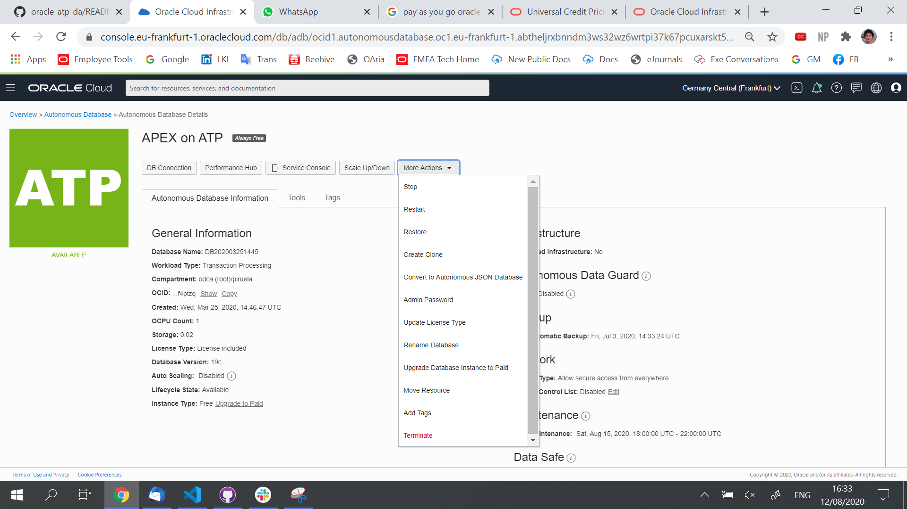
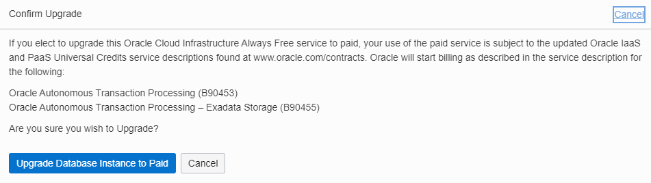
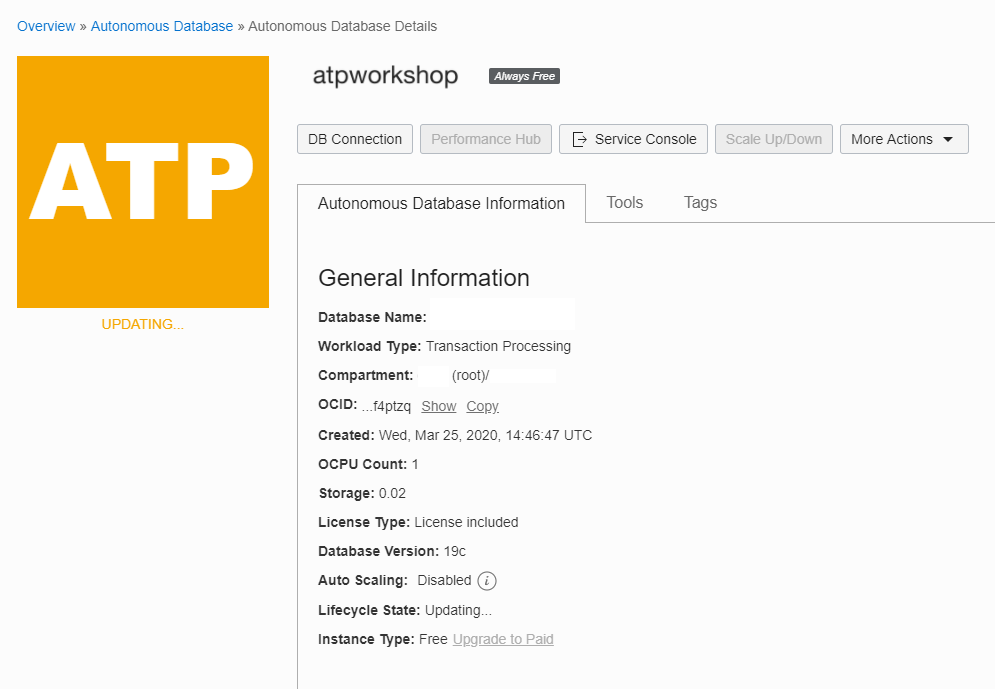
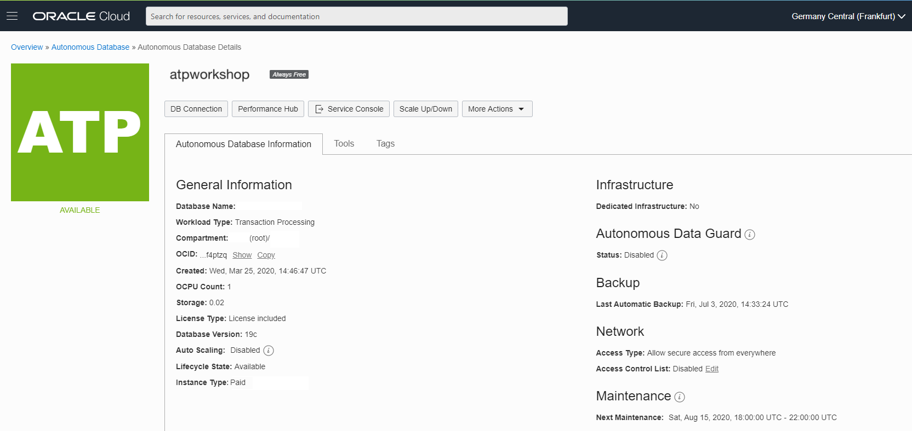

# Next Steps: Upgrade Instances to Paid

I hope you could complete all the labs on this Oracle APEX and Digital Assistant labs and you learn the basic concepts from the technologies that we have use: - **Oracle Autonomous Database** - **Oracle Application Express** - **Oracle Digital Assistant**

The technologies that we have covered on this workshop are using **Always Free** and **Free Trial** credits so you don't have to pay for the services that you have use.

If you want to **Upgrade** the Instances that we used, you can follow these simple steps to upgrade to your favourite subscription model.

[Here you can see the differences models that Oracle has available.](https://www.oracle.com/ie/cloud/pricing.html)

We will show you how to Upgrade from **Always Free** instances right now.

Remember that you will see **Always Free** logo next to the name of your database as part of the database details information. You can see **Instance Type** filled out with **Free Upgrate to Paid**.

We will upgrade to Paid License in this step. You can eiether click on the **Instance Type** that I refered before or click on **More Actions** bottom and go to **Upgrate Database Instance to Paid**, both ways bring you to the same step.

**Confirm Upgrade** window. You can click **Upgdate Database Instance to Paid**.

After you perform this action, your database will be upgrade to **Paid** subsciption. The update will take a few minutes.

You can see that **Instance Type** information has changed from **Free Upgrate to Paid** to **Paid**:

## It works

You have learnd how to Updgrade your Always Free Account to a subsciption model!

---

[**<< Go to Lab 5**](../lab5/README.md) | [Home](../README.md)
